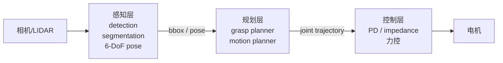
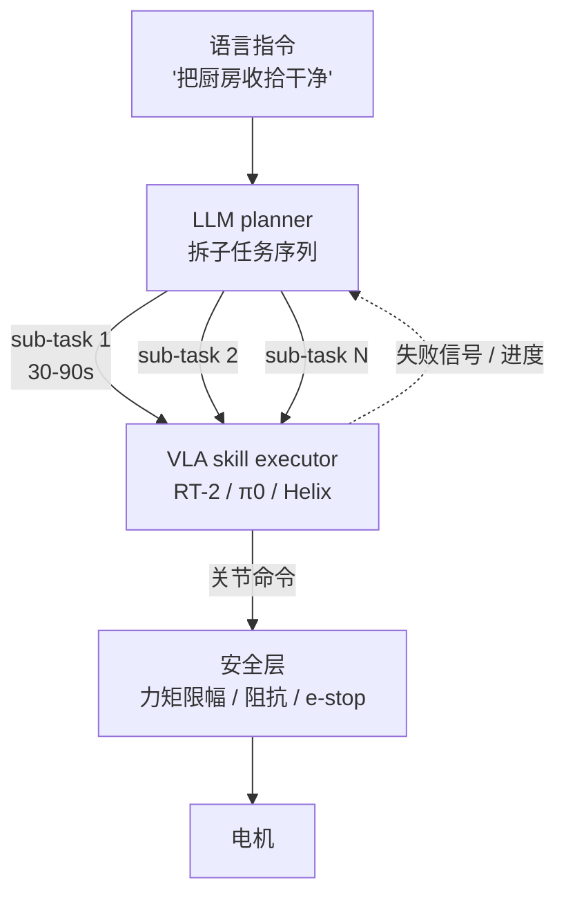

# 第 1 章 端到端与分层

> 这一波具身浪潮里只有一个真正贯穿的判断题：**这件事该让一个网络从像素一路吐到电机，还是该拆成几层？**回答它需要先理解端到端到底买到了什么、没买到什么。

---

2010 年代的机器人栈长这样：摄像头进来，第一层做感知（detection、segmentation、6-DoF 位姿估计），第二层做规划（grasp planner、motion planner、轨迹优化），第三层做控制（PD、impedance、力控）。每一层有自己的输入输出、自己的算法、自己的失败模式。每一层之间用一个固定的中间表示连接：bounding box、grasp pose、joint trajectory。

这个架构的好处是**每一层可以分开调试**。grasp planner 出问题，你不会去重训 detector。motion planner 撞墙了，你换个 collision checker 就完事。每一层都有几十年的工程积累，每一层都有 benchmark，每一层都能写 unit test。

代价是**中间表示是一个瓶颈**。grasp planner 拿到的只是 bounding box，看不见物体表面是软的还是硬的、把手是哪一边、有没有结冰、握太紧会不会捏变形。这些信息在感知阶段就被压成几个数字扔了，到了规划阶段已经追不回来。所以经典栈擅长抓刚体方块，不擅长抓毛巾、塑料袋、装着水的杯子。

LLM 那一套出来之后改变的不是某一层。改变的是**每一层的中间表示都可以由网络自己挑**。

RT-1（Brohan 等，Google，2022 年底）是第一篇说"我们不要分层了，从图像和语言指令直接吐 7-DoF action"的工作，并且真的用 13 万条 teleop 数据让它在多个任务上跑起来。RT-2（2023 年中）把背骨换成 PaLM-E 这种已经在互联网图文上预训过的 VLM，参数从亿级涨到 55B，证明了一件事：**互联网常识可以直接迁移到机器人**。RT-2 第一次能对它从没见过的物体说出合理的 action，比如要它把"灭绝的动物"放进盒子，它会去抓桌上那只玩具恐龙。

2024 年这一线快速分叉。Stanford 的 OpenVLA 把模型缩到 7B 并开源，让所有学校都能 fine-tune。Octo（Berkeley）走 transformer + diffusion head 的路线。Physical Intelligence 在 2024 年 10 月发布的 π0 把动作空间从离散 token 换回连续 flow matching，在双臂折衣服这种长序列任务上做到了第一段大众觉得"这真的不像 demo"的视频。2025 年初 PI 又出了 π0-FAST 把推理频率拉上来。NVIDIA 那边 GR00T 这条线想做 humanoid 通用基础模型。Figure 自家的 Helix 把视觉、语言、控制全合到一个网络里。

这一两年对外的分歧看起来很热闹，但底下都在赌同一件事：**够大的网络 + 够多的演示数据 = 通用具身**。

---

赌赢的部分要承认。

端到端的网络买到了几样**经典栈写不出来的能力**。

第一是**接触模式的连续推断**。把毛巾抓起来需要在抓的同时感受布料的变形，调整握力。这件事经典栈做不出来，因为"布料在我手里现在变形了多少"这种信息没有简单的中间表示。一个端到端网络从触觉 + 视觉 + 本体感觉里学到这种映射，不需要谁把它写成方程。

第二是**多模态线索的融合**。你跟机器人说"把那个红色的、靠左边那个杯子拿过来"，端到端网络可以同时处理颜色、位置、指代。经典栈做这件事要把语言解析成 attribute filter 喂给 detector，每加一种线索就要加一段代码。

第三是**风格的稳定性**。同一个动作，端到端网络出来的轨迹平滑、速度合理、有人手的节奏感。经典栈出来的轨迹是一段段 spline 拼的，机械感重。这件事在工业上无所谓，在家庭和服务机器人面前就是用户买不买账的差别。

这三件事加起来，是 RT-2 / π0 这一线给整个领域带来的真东西。**不是替代经典栈，是补上了经典栈一直补不上的缺口**。

---

赌输的部分也要承认。

端到端到现在解决得很差的事情，主要是三类。

**长程任务**。"把厨房收拾干净"这种 5-10 分钟的任务，端到端网络做不下来。原因不是参数量不够，是数据里几乎没有这种长度的连续轨迹。teleop 收集长程数据的成本是分钟级演示的 50-100 倍，你拿不到足够多。π0 在折衣服上能跑接近 5 分钟连续动作已经是当前 SOTA，再长就开始崩。

**异常恢复**。东西没抓住、抓滑了、抓错了一个，端到端网络的反应通常是继续按原计划走，或者走样到一个谁也没见过的状态卡死。原因是 teleop 数据里都是成功演示，失败和恢复的轨迹被人删掉了。最近几篇 paper 试着加 failure recovery 数据（比如 RT-Trajectory），有一定改善，但远没到能在客户家放心跑的程度。

**结构化推理**。"先拆掉外包装，再打开瓶盖，再倒一杯，再把瓶子放回去"这种带顺序的子任务链，端到端做得很糟。它能在每一步演示过的子动作里表现合理，但子动作之间该谁先谁后，它没有一个稳定的内部表示。

这三件事有一个共同点：**它们需要的不是更多数据，是某种形式的层级**。

---

所以 2024 年中之后，分层悄悄回来了。但回来的方式跟 2010 年代不一样。

新分层是这样：**LLM 当 high-level planner，VLA 当 mid-level skill executor，经典控制器兜底当 safety layer**。

LLM 那一层做的事是把"把厨房收拾干净"拆成"把碗放进水池 → 把瓶子放进回收箱 → 把面包放进面包盒 → 用抹布擦桌子"这样的子任务序列。这件事 GPT-4 / Claude 在 2023 年就能做得很好（Google 的 SayCan 是开山之作，2022 年）。重点不在 LLM 多聪明，在它生成的子任务能不能跟下面的 VLA 接上。

VLA 那一层执行每一个子任务。每一段控制时长大概 30-90 秒，正好是当前 VLA 在 demo 里能稳定跑的窗口。这一层是真东西被造出来的地方。

经典控制器那一层做两件事：**一是关节力矩限幅**，二是**阻抗控制下的接触安全**。你可以把这一层理解成"无论上面那两层怎么疯，这一层保证不会把人砸坏、把物体捏碎、把自己烧掉"。这件事 LLM 和 VLA 都做不了，因为它们的输出本身没有物理保证。

这种三层结构在 2025 年的工业部署里几乎是默认选择。Figure 的 Helix 看起来是端到端，但仔细看 paper 也分成 system 1 和 system 2。1X 的 NEO 在家庭场景里跑的是高度分层的栈，VLA 只在某些子任务里用。Tesla 的 Optimus 走得更保守，到现在大段动作还是规划+控制，VLA 只用在抓取片段里。

---

那么具体到一个项目，怎么判断？

下面这张判断表是这两年我自己用顺手的：

| 任务特征 | 倾向端到端 | 倾向分层 |
|---|---|---|
| 持续时间 < 60 秒 | ✓ |  |
| 持续时间 > 3 分钟 |  | ✓ |
| 接触很多、力控敏感 | ✓ |  |
| 需要明确的子步骤顺序 |  | ✓ |
| 物体形变大（布、绳、食物） | ✓ |  |
| 需要把失败状态报告给上层 |  | ✓ |
| 有现成的 1k+ 演示数据 | ✓ |  |
| 没有演示数据但能写规则 |  | ✓ |
| 失败的安全代价高（接触人、贵重物） |  | ✓ |
| 失败可以重试 | ✓ |  |

不是每一行都同等重要。最重要的两条是**持续时间**和**失败代价**。这两条任意一个偏向分层，整体就该分层，哪怕其他几行偏向端到端。

举个具体例子。一个家庭折毛巾的机器人，单次动作 40 秒，毛巾形变大，掉在地上可以重捡，演示数据相对好收。这种就该端到端。一个家庭整理乱厨房的机器人，单次任务 5-10 分钟，子步骤顺序明确，万一把刀掉地上很危险。这种必须分层，**LLM 当 planner，VLA 只在每个 30 秒的子任务里用**。

最后给一个工程信号：如果你正在 fine-tune 一个 VLA，已经收了超过一万条演示数据，效果还是没法稳定通过验收，**这通常不是数据不够的信号，是任务该分层的信号**。把它拆成 3 个子任务，每个子任务用三千条数据 fine-tune 一个小一点的策略，加一层 LLM planner 把它们串起来，往往一周内就能解决。

---

## 练习

**重读 RT-2 paper 一次**，但这次只读 limitations 和 failure cases 那几节，不读架构和数据。这一节里 Google 自己承认了哪些事？

**找一个你最熟悉的具身 demo video**（任意公司、任意时间），按表格里的 10 行打分。它的实际选择跟你打分的结果一致吗？如果不一致，是公司选错了，还是你对任务的理解不准？

**找一个你以为是端到端的工作**（比如 Helix、π0、GR00T），把它的 system diagram 画在纸上，看里面真的没有任何分层吗？大多数情况你会发现里面有。把它有几层、每层处理多长时间标出来。

下一章：[第 2 章 感知](02-perception.md)
