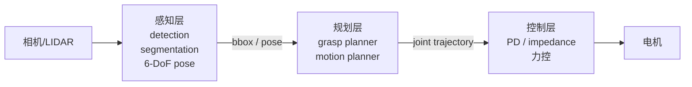
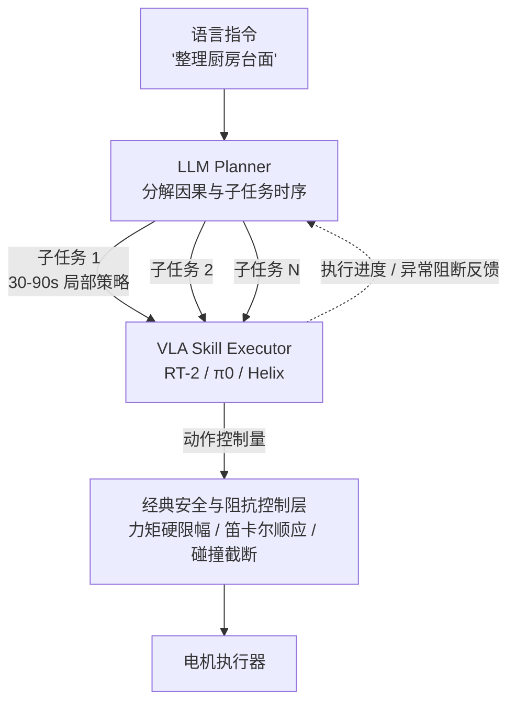

# 第 1 章 端到端与分层

> 具身智能的系统设计里，始终绕不开一个根本取舍：究竟由单个神经网络把原始像素一路算到底层电机力矩，还是把控制链条拆解为层层解耦的流水线。要看清这条分水岭，必须透彻审视端到端范式真正换取了什么，又在何处付出了不可忽视的工程代价。

---

2010 年代经典的机器人软件栈，层次分得清清楚楚：传感器原始数据流进系统，第一层做感知，负责目标检测、实例分割与 6-DoF 位姿估计；第二层做规划，算出抓取位姿、运动轨迹并做避障优化；第三层落到底层控制，由 PD 伺服、阻抗控制与力矩闭环把动作做实。每一层都有明确的输入输出边界、独立的算法体系，还有能够预先推演的失效模式。串起整条流水线的，是包围盒（bounding box）、抓取位姿（grasp pose）与关节轨迹（joint trajectory）这类标准化的中间几何表征。

这套架构最大的长处，在于**模块的可解释性与独立可调测性**。抓取规划算偏了，工程师不必回过头去重训前端感知网络；机械臂在运动规划里遇上碰撞风险，换个更鲁棒的碰撞检测库，或者随手微调代价函数就能化解。每一层背后都站着分析力学与控制理论数十年的积累，底下垫着成熟的基准测试集，也跑着边界确定的单元测试。

分层分得太干净，代价也摆在眼前：刚性的中间表征成了致命的**信息瓶颈**。抓取规划器拿到手里的，仅仅是降维后的三维外接框与位姿矩阵，物体的表面物理特性丢得一干二净：材质的软硬顺应、表面是否结霜、摩擦系数高低、质量分布是否均匀，手指捏下去又会发生怎样的结构形变。这些关键的物理线索在感知阶段就被压缩过滤掉了，流到后面的规划环节再也找不回来。于是经典控制栈能把刚性金属工件搬得分毫不差，可一旦碰上柔软的毛巾、揉变形的塑料袋，或是盛满液体的杯盏，立刻屡屡受挫。

```mermaid
flowchart LR
  CAM[相机/LIDAR] --> P[感知层<br/>detection<br/>segmentation<br/>6-DoF pose]
  P -->|bbox / pose| PL[规划层<br/>grasp planner<br/>motion planner]
  PL -->|joint trajectory| C[控制层<br/>PD / impedance<br/>力控]
  C --> M[电机]
```

多模态大模型与具身表征学习走上台前，动摇的不单是某一个具体功能模块，更是状态表示的底层构建逻辑：中间表征不再指望人工定义的显式几何参数，而是交由网络在训练中隐式地联合优化与自适应对齐。

Google 的 Brohan 等人在 2022 年底推出的 RT-1，第一次在工程上跑通了去分层路线：模型直接吃进图像与自然语言指令，端到端预测 7-DoF 动作，靠着 13 万条真实遥操作数据，在多项任务里做到了连续控制。到了 2023 年中，RT-2 把骨干网络换成在互联网海量图文上预训练的视觉语言模型（如 PaLM-E），参数规模直接拉到 550 亿，实打实地证明互联网规模的多模态常识可以直接迁移到物理交互之中。面对从没见过的物体，RT-2 第一次展现出靠语义推理生成动作的本领，比如接收到“将灭绝动物放进盒子”这句指令时，机械臂能自主认出台面上的玩具恐龙并一把抓取起来。

2024 年之后，这条演化路线迅速散开。Stanford 开源的 OpenVLA 把模型参数压缩到 7B，大幅压低了微调与学术复现的门槛；Berkeley 主导的 Octo 探索了 Transformer 骨干与扩散头（Diffusion Head）的混合架构；Physical Intelligence 在 2024 年底推出的 π0 把动作空间从离散 Token 换成连续流匹配（Flow Matching），在双臂折叠衣物等长程物理接触任务里交出了令人信服的动态连续性；2025 年初问世的 π0-FAST 把闭环推理频率推得更高。与此同时，NVIDIA 拿出 GR00T 搭建通用人形基础模型，Figure 自研的 Helix 也在尝试把视觉、语言与高频全身控制收进同一张单体网络之中。

看似纷繁复杂的路线分歧背后，工业界与学术界其实押注在同一个核心假设上：只要模型容量足够庞大，结合海量的物理演示数据，通用的物理世界交互能力终归会从中涌现出来。

---

### 端到端范式的真实收益

端到端网络在物理世界里，确实展现出经典控制管线难以企及的核心优势：

第一是**连续接触模式的隐式动力学推断**。以抓取折叠毛巾为例，机械臂指尖触碰织物的那一刻起，就必须敏锐捕捉布料连续的细微形变，并实时动态调节抓握的法向力。经典控制管线面对这类场景步履维艰，因为柔性形变与滑动摩擦根本写不出低维、闭式的显式状态方程；端到端网络却能直接从触觉、视觉与关节本体感觉汇成的多模态数据流里，学出状态到动作的非线性流形映射，彻底摆脱了对显式解析方程的苛刻依赖。

第二是**跨模态高维线索的原生融合**。碰到“将左侧偏红且把手带有缺口的马克杯移开”这类复合指令，端到端模型只消一次统一的前向传播，就能同时解算出相对空间位置、精细几何属性与语义指代。要是换成经典管线来做同样的交互，必须先把语言指令拆解成结构化的属性过滤谓词，再级联喂给目标检测器；感知的属性每多一层，整个系统的工程复杂度就会呈阶乘级膨胀。

第三是**运动轨迹的流形平滑性与动态自然度**。面对同样的操作目标，端到端策略输出的控制轨迹通常平滑连贯，速度曲线柔和，自带类似人类动作的动态阻尼感。经典管线靠一段段多项式或样条拼出来的轨迹，总带着明显的机械离散感。这种生硬放在工厂流水线上尚可接受，但真要放进家庭服务或是与人近距离协作的场景，动作是否平顺、节奏是否仿生，往往直接决定了系统的交互亲和力与可信度。

正是这些特质，构成了近些年具身智能领域的实质突破：端到端模型并不是完全推翻经典控制理论，而是在经典几何抽象失效的高维连续接触地带，填补了前所未有的表征空白。

---

### 端到端范式的现实边界

然而，单体端到端模型在应对复杂现实场景时，依然暴露出几处难以回避的结构性缺陷：

**长时程因果漂移**。面对耗时数分钟的复杂复合任务（如“彻底清理厨房台面”），单体端到端策略极易崩溃。卡住脖子的根本瓶颈并非单纯的模型参数量不足，而是连续遥操作轨迹在时间和空间上的复合误差积累。长程演示数据的采集成本往往是短程演示的数十乃至百倍，面对状态空间的指数级扩张更是极难覆盖。哪怕是在双臂折叠衣物任务上达到当前最优水平的策略，一旦连续操作超过数分钟，同样会面临严重的注意力漂移与累积误差发散。

**开环失败恢复的匮乏**。一旦发生物体滑落、微小抓空或感知遮挡，端到端策略通常会出现灾难性的行为走样：要么盲目执行既定轨迹里的残余动作，要么跌入未见状态流形中陷入死循环。究其根源，人类遥操作数据集几乎全由完美的成功演示构成，失败与纠错的负反馈轨迹在清洗阶段被大量剔除。学术界虽然尝试引入扰动恢复数据（如 RT-Trajectory），但距离工业级容错标准仍有本质差距。

**离散因果与时序推理的模糊性**。面对“拆除包装、旋开瓶盖、倒入液体、复原盖体”这类有着严密前置依赖的复合流程，单体端到端网络很难建起稳健的离散状态机表示。单个熟练的子动作它或许能流畅执行，可一旦要在动作之间梳理因果拓扑并校验前置条件，时序上就极易出现混乱。

这三类困境揭示了一个关键的工程事实：要让机器人在长程任务中维持高可靠交互，单靠堆砌数据规模远远不够，系统架构本身必须引入分级抽象。

---

### 现代分层体系的回归

到了 2025 年，分层解耦的思路重新回到具身系统当中。这倒不是把 2010 年代的老分层重新搬出来，而是理出了三道分明的阶梯：大语言模型负责高层的时序与因果规划（System 2），多模态 VLA 接管短时间内的熟练动作（System 1），经典控制器则在最底层守住动力学与物理安全的确定性底线。

高层 LLM 负责把宏观开放指令拆解成环环相扣的原子子任务链，诸如“取杯”、“对准”、“注水”、“移置”。自 Google SayCan 确立这套范式以来，大语言模型展现出出色的时序因果拆解与常识推理能力；系统集成的核心难点，在于如何把离散的文本谓词精确锚定为低层策略的执行边界条件。

中层 VLA 策略专心执行单个原子子任务。它的控制时间窗口通常落在 30 至 90 秒之间。这一尺度恰好处于当前端到端策略的黄金收敛区间：策略能维持高精度，累积误差也还来不及扩散。

底层经典控制器在数百赫兹甚至千赫兹的频率下运行，守住两条绝对底线：关节空间力矩硬限幅与笛卡尔空间顺应性阻抗控制。无论上层神经网络输出怎样异常的动作指令，底层控制回路都能在微秒到毫秒内阻断过载力矩、规避刚性结构的过约束，并在必要时触发紧急防护。这是单靠数据驱动的神经策略难以做到的：神经网络的输出分布天然缺乏确定性的硬物理约束，给不出李雅普诺夫稳定性保证。

这套三层拓扑结构，已是当下工业落地的通行做法。Figure 的 Helix 哪怕外表看起来像单体系统，内里依然严格区分认知的慢思考与控制的快回路；1X 的 NEO 服务机器人把 VLA 严格限定在局部的灵巧作业片段；Tesla Optimus 同样如此，大范围移动与宏观轨迹生成交由经典规划控制，只在近距离自适应抓取时切入神经策略。

```mermaid
flowchart TB
  U[语言指令<br/>'整理厨房台面'] --> L[LLM Planner<br/>分解因果与子任务时序]
  L -->|子任务 1<br/>30-90s 局部策略| V[VLA Skill Executor<br/>RT-2 / π0 / Helix]
  L -->|子任务 2| V
  L -->|子任务 N| V
  V -->|动作控制量| S[经典安全与阻抗控制层<br/>力矩硬限幅 / 笛卡尔顺应 / 碰撞截断]
  S --> M[电机执行器]
  V -.->|执行进度 / 异常阻断反馈| L
```

---

### 工程选型判别准则

面对具体的机器人研发与产品定义，可以用下面这张判别矩阵来衡量技术路线的取舍：

| 任务物理与系统特征 | 倾向端到端神经策略 | 倾向分层混合架构 |
|---|---|---|
| 单次动作持续时间 < 60 秒 | ✓ |  |
| 复合任务持续时间 > 3 分钟 |  | ✓ |
| 连续几何接触、力觉顺应敏感 | ✓ |  |
| 依赖明确的离散时序因果步骤 |  | ✓ |
| 几何形变显著（衣物、线缆、流体） | ✓ |  |
| 需向上层主动上报明确异常状态 |  | ✓ |
| 拥有单任务 1k+ 优质实机演示轨迹 | ✓ |  |
| 缺乏遥操作数据但物理规则清晰 |  | ✓ |
| 失效具有高破坏性（人机共融、贵重构件） |  | ✓ |
| 失败允许瞬态原位重试 | ✓ |  |

在实际的工程权衡里，表里各项特征的权重从来不是平摊的。时程长度与失效代价构成了两道最关键的硬判据：只要任务牵涉长时程的复合状态流转，或是失效后果关乎人身与设备安全，系统架构就必须引入分层防护与状态机校验。

工程里常有这样的体会：团队针对某个复杂场景微调 VLA 策略，采了上万条实机遥操作演示，闭环成功率却依然卡在关键的长程节点上徘徊不前。这往往不是数据质量或网络容量的瓶颈，而是系统缺少因果分层的明确信号。把任务拆解成若干物理上自闭环的子技能，各自用千条级的高质量数据收敛局部策略，再由确定性状态机或 LLM 规划器编排时序，系统往往能在很短的周期内跨过工程收敛的拐点。

---

## 练习

1. **研读 RT-2 原始文献中的失效分析**：跳过前面的架构描述，直接看它在极限环境与长程任务里的失效案例。分析作者团队归纳出的根本局限，辨清其物理本质究竟出在视觉特征的语义混淆，还是动作流形的累积漂移。
2. **解构典型公开演示系统**：挑选业内有代表性的具身演示视频，对照文中的决策矩阵逐项打分。观察其实际系统架构是否符合上述工程权衡；若有出入，推敲其背后的物理假设与工程妥协。
3. **绘制端到端系统的隐藏分层图**：审视常被宣传为端到端的基础模型架构（如 Helix、π0 或 GR00T），画出其真实的计算流水线与通信拓扑，标出系统在时间尺度、控制频率与安全防护上那些显式或隐式的分层界限。

下一章：[第 2 章 感知](02-perception.md)
