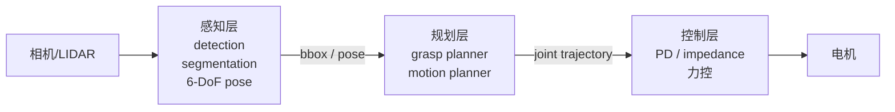
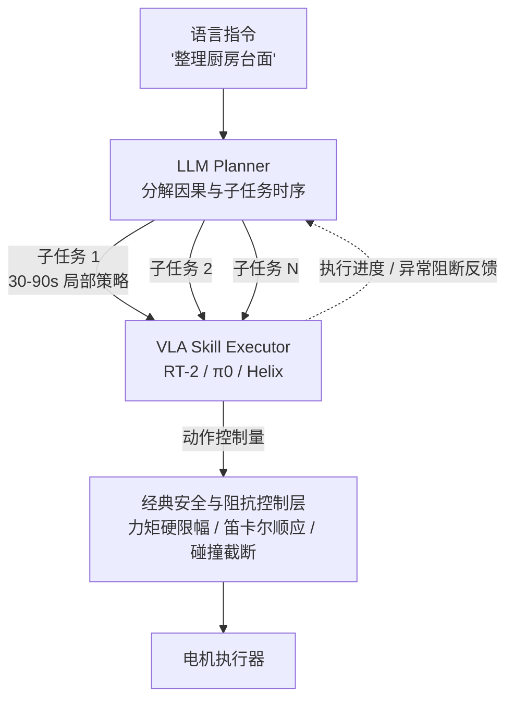

# 第 1 章 端到端与分层

> 具身智能的系统设计中贯穿着一个根本性的权衡：**究竟应当让单一神经网络从原始像素直接映射至底层电机力矩，还是将其拆解为多层解耦的控制流水线？**回答这一命题，必须透彻审视端到端范式真正换取了什么，又在何处付出了不可忽视的工程代价。

---

2010 年代的经典机器人软件栈呈现出清晰的层级解耦结构：传感器原始流进入系统后，第一层执行感知（目标检测、实例分割与 6-DoF 位姿估计），第二层执行规划（抓取位姿生成、运动轨迹规划与避障优化），第三层执行底层控制（PD 伺服、阻抗控制与力矩闭环）。每一层拥有明确的输入输出边界、独立的算法体系以及可预测的失效模式；各层之间由标准化的中间几何表征紧密串接，如包围盒（bounding box）、抓取位姿（grasp pose）与关节轨迹（joint trajectory）。

这一架构的核心优势在于**模块的可解释性与独立可调测性**。当抓取规划发生偏差时，工程师无须重训前端感知网络；当机械臂在运动规划中出现碰撞风险，换用更鲁棒的碰撞检测库或微调代价函数即可解决。每一层都凝聚了数十年的分析力学与控制理论积累，拥有成熟的基准测试集与确定性的单元测试覆盖。

然而，这种清晰分层的代价在于**刚性中间表征构成了严重的信息瓶颈**。抓取规划器所接收的仅仅是降维后的三维外接框与位姿矩阵，完全丢失了物体的表面物理特性：材质的软硬顺应性、表面结霜与摩擦系数、非均匀质量分布以及抓握挤压下的结构形变。这些关键物理线索在感知阶段便被压缩过滤，在后续规划阶段再难追回。因此，经典控制栈能够精准搬运刚性金属工件，却在抓取柔软毛巾、变形塑料袋或盛满液体的杯盏时屡屡受挫。

```mermaid
flowchart LR
  CAM[相机/LIDAR] --> P[感知层<br/>detection<br/>segmentation<br/>6-DoF pose]
  P -->|bbox / pose| PL[规划层<br/>grasp planner<br/>motion planner]
  PL -->|joint trajectory| C[控制层<br/>PD / impedance<br/>力控]
  C --> M[电机]
```

当多模态大模型与具身表征学习兴起之后，被重塑的不仅是单一功能模块，更是状态表示的构建逻辑：**中间表征不再依赖人工定义的显式几何参数，而是交由网络隐式联合优化与自适应对齐**。

RT-1（Brohan 等，Google，2022 年底）首次在工程上验证了去分层范式的可行性：模型直接从图像与自然语言指令端到端预测 7-DoF 动作，依托 13 万条真实遥操作数据在多项任务上实现了连续控制。RT-2（2023 年中）进一步将骨干网络替换为在互联网级海量图文上预训练的视觉语言模型（如 PaLM-E），参数规模跃升至 550 亿，确凿证明了**互联网规模的多模态常识可以直接迁移至物理交互中**。RT-2 首次展现出对未见物体的语义推理动作生成能力，例如当接收到“将灭绝动物放进盒子”的指令时，能够自主识别并抓取台面上的玩具恐龙。

2024 年以来，这一技术演化脉络迅速分化衍生。Stanford 开源的 OpenVLA 将模型参数压缩至 7B，大幅降低了微调与学术复现门槛；Berkeley 主导的 Octo 探索了 Transformer 骨干与扩散头（Diffusion Head）的混合架构；Physical Intelligence 于 2024 年底推出的 π0 将动作空间从离散 Token 升级为连续流匹配（Flow Matching），在双臂折叠衣物等长程物理接触任务中展现出令人信服的动态连续性；2025 年初的 π0-FAST 则进一步推高了闭环推理频率。与此同时，NVIDIA 依托 GR00T 构建通用人形基础模型，Figure 自研的 Helix 亦尝试将视觉、语言与高频全身控制统一编织于单一体网络中。

看似纷繁复杂的路线分歧背后，工业界与学术界实际上共同押注于同一核心假设：**足够庞大的模型容量结合海量物理演示数据，终将涌现通用的物理世界交互能力**。

---

### 端到端范式的真实收益

端到端网络确实在物理世界中展现出经典控制管线难以企及的核心优势：

第一是**连续接触模式的隐式动力学推断**。以抓取折叠毛巾为例，机械臂必须在指尖接触织物的过程中敏锐捕捉布料的连续微小形变，并实时动态调制抓握法向力。经典控制管线在此类场景中举步维艰，因为柔性形变与滑动摩擦缺乏低维、闭式的显式状态方程；而端到端网络能够从触觉、视觉与关节本体感觉的多模态联合流中直接学习状态到动作的非线性流形映射，摆脱了对显式解析方程的苛刻依赖。

第二是**跨模态高维线索的原生融合**。面对“将左侧偏红且把手带有缺口的马克杯移开”这类复合指令，端到端模型能够在一个统一的前向传播中同时解算空间相对位置、精细几何属性与语义指代。若在经典管线中实现同等交互，必须将语言指令先解析为结构化属性过滤谓词，再级联输入目标检测器，系统复杂度随感知维度的增加而呈阶乘级膨胀。

第三是**运动轨迹的流形平滑性与动态自然度**。面对相同的操作目标，端到端策略生成的控制轨迹通常平滑连续、速度曲线柔和且具备类似人类动作的动态阻尼感。经典管线拼接生成的多项式或样条轨迹往往带有明显的机械离散感。这种僵硬在工业流水线上尚可接受，但在家庭服务与人际近距离协作场景中，动作的平顺与仿生节奏往往直接决定了系统的交互亲和力与可信度。

这些特质构成了近几年具身智能的重要突破：**端到端模型并非完全推翻经典控制理论，而是在经典几何抽象失效的高维连续接触区域，填补了前所未有的表征空白**。

---

### 端到端范式的现实边界

然而，单体端到端模型在应对复杂现实场景时，依然暴露出一系列显著的结构性缺陷：

**长时程因果漂移**。面对耗时数分钟的复杂复合任务（如“彻底清理厨房台面”），单体端到端策略极易崩溃。其根本瓶颈并非单纯的模型参数量不足，而是连续遥操作轨迹在时空维度上的复合误差积累。长程演示数据的采集成本往往是短程演示的数十乃至百倍，且极难覆盖状态空间的指数级扩张。即使是在双臂折叠衣物任务上达到当前最优水平的策略，在突破数分钟连续操作时亦会面临严重的注意力漂移与累积误差发散。

**开环失败恢复的匮乏**。一旦发生物体滑落、微小抓空或感知遮挡，端到端策略通常表现出灾难性的行为走样，要么盲目执行既定轨迹的残余动作，要么跌入未见状态流形中陷入死循环。究其根源，人类遥操作数据集几乎全由完美的成功演示构成，失败与纠错的负反馈轨迹在清洗阶段被大量剔除。尽管学术界尝试引入扰动恢复数据（如 RT-Trajectory），但距离工业级容错标准仍有本质差距。

**离散因果与时序推理的模糊性**。诸如“拆除包装、旋开瓶盖、倒入液体、复原盖体”等强时序前置依赖的复合流程，单体端到端网络难以建立稳健的离散状态机表示。它虽能流畅执行任意单一熟练子动作，但在子动作之间的因果拓扑与前置条件校验上极易出现时序混乱。

这三类困境揭示了一个核心工程事实：**长程与高可靠交互所匮乏的，不仅是数据规模的堆叠，更是系统架构层面的分级抽象**。

---

### 现代分层体系的回归

进入 2025 年，层级解耦思想在具身系统中实现了高阶回归。与 2010 年代的传统分层不同，现代分层架构形成了清晰的认知与物理控制梯次：**大语言模型充当高层时序与因果规划器（System 2），多模态 VLA 充当短时熟练技能执行器（System 1），经典控制器提供确定性的底层动力学与安全兜底**。

高层 LLM 负责将宏观开放式指令拆解为严密的原子子任务链（如“取杯”、“对准”、“注水”、“移置”）。自 Google SayCan 确立这一范式以来，大语言模型展现出卓越的时序因果拆解与常识推理能力；系统集成的核心挑战在于如何将离散文本谓词精确锚定为低层策略的执行边界条件。

中层 VLA 策略负责执行单一原子子任务。其控制时间窗口通常收敛在 30 至 90 秒之间，这一时间尺度恰好处于当前端到端策略能够保持高精度、低累积误差的黄金收敛区间。

底层经典控制器则在数百赫兹乃至千赫兹频率下维系两个绝对底线：**关节空间力矩硬限幅**与**笛卡尔空间顺应性阻抗控制**。无论上层神经网络输出何种异常动作指令，底层控制回路均能在微秒至毫秒级阻断过载力矩、规避刚性结构过约束并触发紧急防护。这是纯数据驱动的神经策略难以企及的，因为神经网络的输出分布天然缺乏确定性的硬性物理约束与李雅普诺夫稳定性保证。

这种三层拓扑结构已成为当下工业落地的主流选择。Figure 的 Helix 在单体表象之下依然严格区分认知慢思考与控制快回路；1X 的 NEO 服务机器人将 VLA 严格限定于局部灵巧作业片段；Tesla Optimus 亦在大范围移动与宏观轨迹生成中深度依赖经典规划控制，仅在近距离自适应抓取时切入神经策略。

```mermaid
flowchart TB
  U[语言指令<br/>'整理厨房台面'] --> L[LLM Planner<br/>分解因果与子任务时序]
  L -->|子任务 1<br/>30-90s 局部策略| V[VLA Skill Executor<br/>RT-2 / π0 / Helix]
  L -->|子任务 2| V
  L -->|子任务 N| V
  V -->|动作控制量| S[经典安全与阻抗控制层<br/>力矩硬限幅 / 笛卡尔顺应 / 碰撞截断]
  S --> M[电机执行器]
  V -.->|执行进度 / 异常阻断反馈| L
```

---

### 工程选型判别准则

面对具体的机器人研发与产品定义，可以通过如下维度建立量化判别矩阵：

| 任务物理与系统特征 | 倾向端到端神经策略 | 倾向分层混合架构 |
|---|---|---|
| 单次动作持续时间 < 60 秒 | ✓ |  |
| 复合任务持续时间 > 3 分钟 |  | ✓ |
| 连续几何接触、力觉顺应敏感 | ✓ |  |
| 依赖明确的离散时序因果步骤 |  | ✓ |
| 几何形变显著（衣物、线缆、流体） | ✓ |  |
| 需向上层主动上报明确异常状态 |  | ✓ |
| 拥有单任务 1k+ 优质实机演示轨迹 | ✓ |  |
| 缺乏遥操作数据但物理规则清晰 |  | ✓ |
| 失效具有高破坏性（人机共融、贵重构件） |  | ✓ |
| 失败允许瞬态原位重试 | ✓ |  |

在实际工程权衡中，上述权重的优先级并非均等。**时程长度**与**失效风险**构成了最具决定性的硬性判据：只要任务涉及长时程复合状态流转，或失效代价涉及人身设备安全，系统架构就必须强制引入分层防护与状态机校验。

一个典型的工业实践经验是：当团队针对某一复杂场景微调 VLA 策略，累积采集了超过一万条实机遥操作演示，策略的闭环通过率依然在关键长程节点振荡不前时，**这往往不是数据质量或网络容量的瓶颈，而是系统缺乏因果分层的明确信号**。将任务解耦为若干物理闭环的子技能，分别以千条级高质量数据收敛局部策略，再依托确定性状态机或 LLM 规划器进行时序编排，系统往往能够在极短周期内跨越工程收敛的拐点。

---

## 练习

1. **研读 RT-2 原始文献中的失效分析**：跳过前置架构描述，重点审视其在极限环境与长程任务中的失效案例。分析作者团队归纳的根本局限性，其物理本质究竟归因于视觉特征的语义混淆，还是动作流形的累积漂移？
2. **解构典型公开演示系统**：选取业内具有代表性的具身演示视频，对照文中的决策矩阵进行逐项打分。其实际系统架构是否符合上述工程权衡？若存在差异，其背后的物理假设与工程妥协何在？
3. **绘制端到端系统的隐藏分层图**：审视主流宣传为端到端的基础模型架构（如 Helix、π0 或 GR00T），画出其真实的计算流水线与通信拓扑。标注出其在时间尺度、控制频率与安全防护上的显式或隐式分层界限。

下一章：[第 2 章 感知](02-perception.md)

