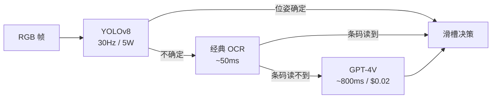

# 第 2 章 感知

> 第 1 章把"端到端 vs 分层"这个判断尺立起来了。这一章把那把尺压到感知模块上：**2024 之后机器人能"看见"的东西，跟 2020 年完全不是一回事，但能不能信它，是另一回事**。

---

考虑这样一种已经在国内外仓储拣选公司里反复出现的工程演化。任务是把流水线传送带上来的、随机姿态的、没见过的快递盒分类放到三个滑槽里。盒子上贴着各种各样的标签：DHL、顺丰、FedEx、SF Express、UPS、还有手写的私人地址。前一代系统是 YOLOv8 加上一个力闭环抓手，对盒子能抓，但对"哪个滑槽"这一步要靠条码扫描，扫不到的就从兜底滑槽出去再人工分。兜底滑槽每天大概接 18% 的件。

2024 年这一波开始普遍试一件事：把摄像头的 RGB 帧丢给 GPT-4V，问它"这个盒子应该走哪条线"。GPT-4V 看一眼能直接读出盒子上的中文地址、英文公司、手写邮编，给出一个置信度合理的滑槽决策。**18% 兜底率掉到 4%**。但代价是单帧 800 毫秒，传送带不能不停，于是 GPT-4V 的调用被节流到只在前一段经典视觉给不出答案时才触发。这段流水线从此变成一个三层栈：YOLOv8 抓盒子位姿 + 经典 OCR 读条码 + GPT-4V 处理"这玩意儿到底是什么"的尾部 case。

**这就是 2024 之后机器人感知栈的典型形状：经典感知做主干，VLM 处理尾部，谁也没替代谁**。看清这件事，是这一章的核心判断。

---

先把 2010 年代的经典感知栈快速过一遍，因为后面要不停回头引它。

经典感知栈处理的核心问题是这样几个：

**Detection**：图像里有什么、在哪。从 R-CNN 系列（Girshick 2014）到 Faster R-CNN（Ren 等，2015）到 YOLO 系列（Redmon 起头，到 v8、v9、v10 已经是各家在做）到 DETR（Carion 等，Facebook，2020）。这一线的输出是一堆带类别标签的 bounding box，类别是训练时固定下来的几十到上千个。

**Segmentation**：每个像素属于哪一个物体。Mask R-CNN（He 等，2017）是分水岭，之前是 FCN、U-Net 那一套。语义分割和实例分割是两条线，工业上常需要的是后者。

**Depth estimation**：每个像素离相机多远。要么靠双目（OAK-D、ZED、RealSense D435 这些设备直接给，两只眼三角测量出深度），要么靠 LiDAR（Velodyne、Hesai、Livox 这些激光雷达品牌），要么靠单目深度网络（这一线 2024 之前一直不稳）。在桌面机械臂场景，最常见的是 RealSense D435 或 D455，给到 30Hz 的稠密深度图，但近距离 15cm 以下不可信。

**Pose estimation**：对一个已知物体，估它的 6-DoF 位姿（x、y、z 平移加 roll、pitch、yaw 旋转，共六个数）。这件事在抓取里是核心。经典做法是 PoseCNN（Xiang 等，2018）、DenseFusion（Wang 等，2019），后来 FoundationPose（NVIDIA，2024）做到了对未见物体的零样本 pose estimation，是这一线少数被 LLM 浪潮推着前进的工作。

**SLAM 前端**（边走边定位的几何骨架）：相机自己在世界里的位姿。ORB-SLAM3（Campos 等，2021）、VINS-Fusion（HKUST，2018，视觉惯性紧耦合）、Kimera（MIT，2020）这一线在视觉惯性里跑了很久。室外大场景这两年被 Gaussian Splatting 类的 dense reconstruction 推了一把，但 SLAM 前端的位姿估计本身还是 feature-based 的天下。

这套栈每一块都成熟、都有 benchmark、都能写 unit test。它不够的地方第 1 章已经讲过：**中间表示是固定类别的 bounding box 和深度图，没有语义弹性**。你训了一个能识别 80 个 COCO 类的 detector，部署到家庭场景里看到一个"小米电饭煲"，它要么把它叫成 "microwave"，要么干脆给个低置信度的 "appliance"，反正不会告诉你这玩意是煮饭的。这是经典感知栈的硬限制，不是工程问题，是设定问题。

---

2024 这一波带进来的几样东西，按顺序点一下，每一样都讲它**真的解决了什么、真的没解决什么**。

**VLM 当感知接口**。GPT-4V（OpenAI，2023 年 9 月）、Claude 3 系列（Anthropic，2024 年 3 月起）、Gemini Pro Vision（Google，2024）、Qwen2-VL（阿里，2024）、InternVL（上海 AI Lab，2024）这一线把"看图说话"做到了通用水平。喂一张机器人摄像头的图，问"桌上有几个杯子？哪个是空的？"，回答能用。这件事在 2022 之前不存在，2023 还很贵很慢，2024 中之后是工业可用的。但**这种用法本质上是在用 VLM 当一个语义查询接口，不是当 detector**。它给不出像素级精确的位置，给不出 6-DoF 位姿，给不出可重复的几何输出。把它当 detector 用是这一年最常见的项目失败模式。

**开放词表检测**。OWL-ViT（Minderer 等，Google，2022）、GroundingDINO（IDEA，2023）、OWLv2（Google，2023）、YOLO-World（Tencent，2024）这一线的核心能力是：你给一段文本 "red mug on the left"，它直接吐 bounding box。比 VLM 快很多（GroundingDINO 在 RTX 4090 上能到 30Hz 量级），比经典 detector 灵活很多。在生产里这是 2025 年大多数家庭/服务机器人感知栈的实际主力，不是 GPT-4V。**它是真把 detection 这件事的弹性买回来了**。但它的失败模式也明确：对很相似的物体（"the small red mug" vs "the slightly bigger red mug"）分辨不开，对密集小物体（一桌子杂物）框得乱。

**通用分割**。SAM（Kirillov 等，Meta，2023 年 4 月）和 SAM 2（Meta，2024 年 7 月）这一线买到了"对任意物体出 mask"的能力。SAM 2 的关键升级是把视频带进来，能跨帧跟踪一个 mask，这件事对机器人很重要，因为机器人的视野是连续的视频流不是静态图。EfficientSAM（Meta，2024）、MobileSAM、FastSAM 是为了在边缘设备跑起来出的几条优化线。**SAM 把分割从一个需要标数据训模型的任务，变成了一个需要给 prompt 的任务**。这是质变。但 SAM 不知道它分出来的是什么，它只给 mask 不给标签。所以工业用法基本都是 GroundingDINO + SAM 串联：前者给框，后者把框变 mask。Grounded-SAM（IDEA，2023）就是这件事的现成实现。

**通用深度**。Depth Anything（Yang 等，HKU + TikTok，2024 年 1 月）、Depth Anything V2（同组，2024 年 6 月）、MiDaS（Intel，从 2019 起一直在更）、ZoeDepth（Bhat 等，2023）。这一线是 2024 年最被低估的一波。在此之前，**单目深度这件事在机器人里基本不能用**，要么靠 RGB-D 相机，要么靠 LiDAR。Depth Anything V2 训完之后，单目深度的相对精度首次到了能在桌面任务里参考的水平。绝对深度仍然不行，但跟 RGB-D 相机融合做尺度对齐，在近距离杂乱场景下比纯 RGB-D 鲁棒，因为 RGB-D 对透明物（玻璃杯、水）和高反光（不锈钢）都瞎。

**CLIP 嵌入当语义查询**。这件事概念上从 2021 年 OpenAI 发 CLIP 那篇就在了，但 2023 之后才在机器人里铺开。OpenScene（Peng 等，2023）、ConceptFusion（Jatavallabhula 等，MIT，2023）、LERF（Kerr 等，Berkeley，2023）这一线把 3D 场景每个点都关联一个 CLIP 嵌入向量，然后你在运行时用一段文本（"the thing I would use to open a bottle"）做语义检索，直接拿到 3D 位置。**这件事经典栈做不出来，因为经典栈没有"概念向量"这种中间表示**。这一线在 2025 年还是研究多于部署，但已经能看出会进生产，因为它解决的是"用户在家说一句模糊的话，机器人能不能找到对应物体"这个核心场景问题。

把这五条加起来看，2024 之后机器人感知栈的实际形状是：**经典 detector 处理 head，开放词表 detector 处理 mid-tail，VLM 处理 long-tail 和"这是什么意思"型查询，SAM 把框变 mask，Depth Anything 跟 RGB-D 融合，CLIP 嵌入当语义检索的桥**。哪一项都没替代谁。

---

触觉这条线要单拎出来讲，因为它跟视觉那条线节奏完全不一样。

视觉感知 2024 是大年。触觉感知 2024 没有大年。但触觉这件事在机器人里的地位反而在悄悄变重要。原因很直接：**端到端 VLA 在抓毛巾、抓水果、抓塑料袋这种形变物体上的进步，离不开触觉做反馈**。

触觉传感器这两年值得点名的就这几条：

**DIGIT**（Lambeta 等，Meta，2020）。一个用 GelSight 原理做的、便宜（百美元级）、3D 打印外壳、LED + 摄像头读硅胶变形的指尖触觉。Meta 自己开源了硬件设计和 SDK。它带起来的是"触觉信号本质是图像，可以直接喂 CNN/transformer"这个范式。

**GelSight 系列**（MIT 起家，2017 年起一直迭代）。比 DIGIT 出现早，分辨率更高，工艺更复杂，价格也更高。2024 年 GelSight Mini 把成本压下来。

**ReSkin**（CMU，2021）。磁感应+机器学习的触觉皮肤，可以铺到大面积曲面上。这件事跟 GelSight 路线不一样，GelSight 是指尖局部高分辨率，ReSkin 是大面积低分辨率覆盖。

**AnySkin**（NYU + Meta，2024）。ReSkin 的工程化继承者，把 calibration 这件事做成"换一片皮就能继续用，不需要重训"。这是触觉传感器在产品化上少见的真进展。

**Allegro Hand + Tactile**、**LEAP Hand**（CMU，2023）这一线是把触觉做到整只灵巧手上。Shadow Robot Hand 是老牌但贵。

为什么触觉没爆？三个原因。第一，**没有 ImageNet**。视觉感知能爆是因为有几亿张带标签互联网图片，触觉信号没有这个。每家的传感器输出格式不一样，硅胶变形信号没有可迁移的预训练。第二，**仿真做不真**。视觉的 sim2real 已经困难，触觉的 sim2real 几乎是研究问题，因为硅胶接触力学没有简单的可微模型。第三，**没有杀手 demo**。视觉那边 GPT-4V 一出来所有人都看到能干什么，触觉到现在没有一个"看了就懂"的 demo 让外行投资人愿意砸钱。

但触觉对端到端 VLA 是绕不过去的。**π0 在 2024 年的折衣服 demo 里没有触觉，靠的是双臂视觉对夹的反馈，这是它能做但很多家庭杂活做不到的边界**。家务里大量任务（拧瓶盖判断"拧到位"、拿鸡蛋判断"握太紧"、整理衣物判断"抓住了几层"）没有触觉就做不下来。**2026 之后这一线如果要爆，最可能是哪家公司把 DIGIT 类传感器装到一只 LEAP Hand 上，跑出第一段双臂叠几件不同质地衣服的 demo**。在那之前，触觉在生产部署里的地位是：你知道你需要它，但还没人能说清怎么用它。

---

多模态融合这件事，做错的人比做对的人多。

机器人感知最终拿到的不是一路信号，是 RGB（30Hz）+ depth（30Hz）+ 触觉（100Hz）+ 本体感觉（关节角度速度，1kHz）+ 麦克风（16kHz 或 48kHz）。理论上喂给一个 transformer 让它自己学融合，听起来很美。**实际上直接 concat 各路特征是这两年最常见的设计错误**。

错在哪？三件事。

**频率不匹配**。直接 concat 要求所有信号被对齐到同一个时间步。最常见的做法是把高频信号（本体感觉、触觉）下采样到视觉的 30Hz。这一下采样把"指尖触感的高频微小颤动"这种本来就该用高频读取的信号信息扔了，而这正是触觉为什么被加进来的理由。

**分辨率不匹配**。RGB 是 H×W×3 的稠密图，本体感觉是 7 个数字。直接 concat 会让 7 个本体感觉数字在 token 序列里被几千个图像 token 淹没。模型在训练时基本学不到本体感觉的权重。这件事在 RT-1 时代被 Brohan 那组讨论过，他们的解决是给本体感觉单独 token 化、单独嵌入，concat 之前先各自过 encoder。

**异构噪声**。视觉的噪声是亮度变化、运动模糊。触觉的噪声是硅胶老化、温度漂移。本体感觉的噪声是关节编码器累积误差。这些噪声分布完全不一样，喂给同一个 dropout / normalization 不合理。**好的设计是每一路先在自己的 encoder 里走完归一化，再融合**。

正经的融合做法这两年收敛到几条路线。**Per-modality encoder + cross-attention**：每路信号自己一个 encoder，然后用 cross-attention 把高频低维信号"查询"到视觉嵌入上。Octo 走的是这条路。**Tokenize everything**：把每一路信号 tokenize 成统一长度的 token 序列，丢给一个共享 transformer。RT-2 这一线偏向这条。**Late fusion**：每一路信号自己跑出一个动作分布，最后一层加权融合。在工业里更稳，但天花板低。

哪种更好取决于你下游任务对哪一路最敏感。但一条铁律：**先 per-modality 归一化，再融合。直接拼是行业新手的毕业典礼**。

---

接下来正面回答这一章最实操的那个问题：**用 VLM 当感知模块的代价是什么？**

**延迟**。GPT-4V 通过 OpenAI API 一次调用 800 毫秒到 1.5 秒。Claude 3.5 / 4 系列在 2024 末已经压到 400-700ms。Gemini 系列加上 Vertex AI 部署可以到 300-500ms。开源的 Qwen2-VL-7B 本地跑能到 150-300ms。如果你的任务循环要求 10Hz 闭环（100ms 一帧），**这些都不够用**。VLM 在感知栈里的位置只能是低频查询，不是闭环反馈。

**贵**。GPT-4V 一次调用大概 0.01-0.03 美元（看 token 数）。一台机器人每秒查一次，一天工作 8 小时，每天 0.3-1 美元。一万台机器人就是每天三千到一万美元的纯感知成本，并且这个数字在你的 BOM（物料清单）里完全独立于硬件折旧。这件事 2024 创业公司经常没算清楚。开源模型本地跑能把这个成本降到接近零，代价是你要养 GPU、养 inference 团队、忍受比 API 慢的迭代。

**对新颖姿态会幻觉**。这是 VLM 最被低估的失败模式。给它一张正常方向的杯子图，它告诉你这是杯子。给它一张倒扣的杯子图，它仍然告诉你这是杯子，但如果问"杯口朝哪边"，**它会编**。VLM 在训练数据里见过几十亿张直立杯子的图，没见过几张倒扣的。机器人在工作里恰恰大量遭遇训练数据稀有的姿态：物体侧躺、半遮挡、被另一物体压住。**经典 6-DoF pose estimator 在这种情况下要么报失败要么报错误数字，VLM 会报一个流畅的、错误的、自信的答案**。这件事在安全相关的任务里是致命的。

**无法做几何精确输出**。VLM 可以告诉你"杯子在桌子左边"。它给不出"杯子中心在相机坐标系下 (x=0.32, y=-0.15, z=0.78)"。要拿到机器人能用的 6-DoF pose，你最终还是要回到 FoundationPose、PoseCNN、ICP 这一线，或者用 GroundingDINO + SAM + Depth Anything 拼一个粗略 6-DoF（用 mask 的几何中心 + depth + camera intrinsics 反投影）。VLM 在这个链条里的位置是上游：它告诉你**该看哪个物体**，下游模块告诉你**这个物体在三维里在哪**。

---

立场说清楚。

**安全相关的 detection 不要交给 VLM**。如果一个 detection 错误的代价是机器人撞人、夹断手指、把贵重物体砸坏，**这个 detection 必须有经典 detector 兜底**，并且经典 detector 要做主决策，VLM 至多做语义增强。理由就是上面讲的"流畅的、错误的、自信的答案"。一个经典 YOLO detector 给你 0.43 置信度的时候你知道它不确定，可以走兜底逻辑。VLM 给你"我看到那只猫在沙发上"的时候没有一个数值 confidence 可读，你不知道它是知道还是在编。

**语义 query 才是 VLM 的甜点**。"用户说的'那只大的'指哪一个"、"这个东西能不能进微波炉"、"地上这摊液体看起来像水还是像油"，这些问题经典栈不会回答，VLM 答得很好。把 VLM 限制在"开放语义解释"这个角色里，不要让它做几何、不要让它做安全决策、不要让它做闭环反馈，**它就是这一波感知栈里增量价值最高的一块**。

---

下面是一张实操的对照表。**给定一个具体任务，该用什么感知组件**。这张表我自己在过去一年用得很顺手，列在这里给你拿去骂或者拿去用。

| 任务类型 | 经典 detector | 开放词表 (GroundingDINO/OWLv2) | SAM/SAM2 | Depth Anything | RGB-D / LiDAR | VLM (GPT-4V/Claude/Gemini) | 6-DoF pose estimator | 触觉 |
|---|---|---|---|---|---|---|---|---|
| 流水线已知物体抓取 | 主力 |  |  |  | 主力 |  | 主力 |  |
| 家庭未见物体抓取 |  | 主力 | 主力 | 辅助 | 主力 | 语义解析 | 辅助 | 辅助 |
| 户外移动机器人导航 | 主力 |  |  | 辅助 | 主力 |  |  |  |
| 仓储分拣含手写标签 | 主力（盒检测） |  |  |  | 辅助 | 尾部 case |  |  |
| 折毛巾/叠衣服 |  | 辅助 | 辅助 |  | 主力 |  |  | 主力 |
| 倒水/拧瓶盖 |  |  |  |  | 辅助 |  | 主力 | 主力 |
| 用户口语指令找物体 |  | 主力 |  |  |  | 主力 |  |  |
| 安全相关接近人 | 主力 |  |  |  | 主力 |  |  |  |
| 语义场景理解（"厨房乱不乱"） |  |  |  |  |  | 主力 |  |  |
| 透明/反光物体抓取 |  | 辅助 | 辅助 | 主力 | 辅助 |  | 主力 | 辅助 |

读这张表的时候注意三件事。第一，**"主力"列同一行经常有两到三项，意思是这件事必须靠多模态融合，不是哪一个能单干**。第二，**安全相关接近人那一行 VLM 列是空的，这是有意的**。第三，**语义场景理解那一行只有 VLM 是主力，这反映了 VLM 在感知栈里的真甜点**。

---

回到这一章开头那个仓储分拣的例子。回头看那个三层栈的设计：YOLOv8 处理"盒在哪"（经典 detector 主力），OCR 处理"条码是什么"（经典栈），GPT-4V 处理"这玩意儿是干嘛的、地址写的是哪"（VLM 处理 long-tail 语义）。这个分工不是因为他们读了哪本书，是因为他们在生产里挨了几个月打才收敛到这个形状。**这一章想让你少挨几个月打**。

下一章会从感知走到动作。同样的判断尺：什么交给端到端 VLA、什么交给经典控制器、什么交给 LLM 当 high-level planner。感知和动作的分工区别在于，感知里 VLM 处理 long-tail 是新增能力，动作里 LLM 处理 long-tail 还远没那么稳。这件事下章细讲。

---

## 练习

**重读 SAM 那篇 paper（Kirillov 等，2023）一次**，但这次只看它的失败 case 和"什么时候 SAM 会出错"那几节。Meta 自己列出来的失败模式有几类？这几类失败模式在你自己见过的机器人 demo 里出现过没有？如果出现过，那个 demo 是怎么绕过去的？

**找一段你最近看过的家庭机器人 demo video**，把里面每一个明显的感知步骤标出来（机器人识别了什么、定位了什么、判断了什么）。然后给每一步打一个标签：经典 detector / 开放词表 / SAM / VLM / 6-DoF pose / 不知道。**"不知道"那几步是这段 demo 在 marketing 上对你藏起来的部分**。

**重读 Depth Anything V2 那篇 paper**，但这次只读它跟 MiDaS、ZoeDepth 比较的那几个表。具体到家庭机器人的桌面距离（30cm 到 1.5m），这几个模型谁更准？你之前对单目深度的印象，在这张表面前有多少需要更新？

**找一篇你以为是端到端 VLA 的工作（π0、OpenVLA、Helix 任选）**，仔细读它的 system 图和 input 描述。它的输入只有 RGB 吗？还是有 depth、proprioception、触觉？如果有不止 RGB，那它在感知层面其实**已经做了 per-modality encoding**，不是真的"像素到电机"那种纯端到端。这件事跟它对外的叙述一致吗？

下一章：[第 3 章 动作](03-action.md)
