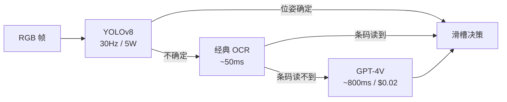

# 第 2 章 感知

> 第 1 章确立了“端到端与分层架构”的核心判别标尺。本章将这把标尺切入感知模块：**现代具身系统所能“看见”与“理解”的信息流形已发生质的飞跃，但能否在物理闭环中无条件信任它，则属于另一维度的工程拷问**。

---

在工业仓储分拣场景中，系统往往需要面对传送带上姿态随机、品类未知的海量包裹：标签涵盖各类物流企业、国际运单以及手写字迹。前一代系统的标准架构通常由 YOLO 系列检测器配合力控夹爪构成：机械抓取相对可靠，但流向分流主要依赖条码扫描仪；一旦条码受损或遮挡，包裹便被分流至人工复检滑槽。在实际产线中，这类异常兜底件通常占据日均吞吐量的 15% 至 20%。

随着多模态大模型的发展，工程团队开始尝试将高分辨率 RGB 图像帧送入多模态大模型（如 GPT-4V），由其直接解析手写地址与语义标识并给出滑槽决策。**这一改进使人工兜底率从 18% 骤降至 4%**。然而，多模态推理往往伴随着数百毫秒的计算延迟，流水线却无法停顿。最终的工业解决方案将大模型调用严格限制在经典视觉无法断言的边缘样本上。感知系统由此重塑为三层级联流水线：经典检测器负责毫秒级位姿估计，OCR 引擎负责结构化条码解析，视觉大语言模型则充当处理长尾疑难语义的仲裁节点。

**这正是现代具身感知栈的典型拓扑：经典几何感知构筑坚实主干，多模态大模型攻克语义长尾，二者协同互补，而非简单替代**。理解这一系统分工，是掌握现代具身感知工程的认知基石。

```mermaid
flowchart LR
  IMG[RGB 帧] --> Y[YOLOv8<br/>30Hz / 5W]
  Y -->|位姿确定| OUT[滑槽决策]
  Y -->|不确定| O[经典 OCR<br/>~50ms]
  O -->|条码读到| OUT
  O -->|条码读不到| V[GPT-4V<br/>~800ms / $0.02]
  V --> OUT
```

---

### 经典感知管线及其物理边界

经典机器人感知栈构筑在清晰的几何与模式识别基石之上：

**目标检测（Detection）**：从 R-CNN、Faster R-CNN 到 YOLO 家族与 DETR，该分支的核心产物是附带预定义类别标签的三维或二维包围盒（Bounding Box）。其分类空间受限于离散预设词表。

**实例分割（Segmentation）**：自 Mask R-CNN 确立标准范式以来，分割网络能够在像素级精度上区隔目标轮廓，为后续机械接触与碰撞检测提供精确的边界支持。

**深度估计（Depth Estimation）**：从双目立体匹配（如 RealSense、ZED）、多线激光雷达（LiDAR）到单目深度神经网络。在桌面操作场景中，主动双目红外相机（如 RealSense D435i）可在 30Hz 频率下提供稠密深度图，但在 15cm 以内的近场盲区、高反光表面与透明介质面前极易失效。

**6-DoF 位姿估计（Pose Estimation）**：针对已知三维几何模型，精确估算其在相机坐标系下的 6 自由度空间变换矩阵（$SE(3)$ 平移与旋转）。从 PoseCNN、DenseFusion 到近期的零样本 FoundationPose，该模块是结构化精密抓取的算力核心。

**视觉 SLAM 前端**：从 ORB-SLAM3、VINS-Fusion 到 Kimera，视觉惯性紧耦合（VIO）在连续空间中维系着自车或本体的确定性位姿估计。

上述经典模块具备极高的成熟度、完备的基准测试集与严格的确定性单元测试。然而，正如第 1 章所述：**其致命缺陷在于固定的中间几何抽象缺乏语义弹性**。一个在 COCO 数据集上训练的目标检测器，面对家庭场景中的新型小家电，往往只能输出粗糙的通用标签或低置信度的错误归类，更无法理解其功能属性与交互逻辑。

---

### 多模态表征技术的代际跃迁

近年来涌现的多模态大模型技术，在不同维度上重构了感知系统的能力边界：

**视觉大语言模型（VLM）作为语义查询接口**。GPT-4V、Claude 3.5、Gemini Vision、Qwen2-VL 以及 InternVL 将图像语义理解推向了通用认知高度。机器人不仅能识别物体的存在，更能推理复杂空间关系与物理属性（如“哪个容器是空的”、“把手是否易碎”）。但必须牢记：**VLM 的本质是高维语义推理引擎，而非精准几何检测器**。它无法稳定输出亚毫米级的像素坐标与 6-DoF 位姿矩阵；将其错误地充当低层几何定位模块，是具身感知系统中最常见的架构失误。

**开放词表检测（Open-Vocabulary Detection）**。以 GroundingDINO、OWL-ViT 与 YOLO-World 为代表的技术，允许系统直接依据自然语言提示（如“左侧带有缺口的深蓝色水杯”）动态预测边界框。其在高性能显卡上的推理帧率可达 30Hz，在保持高吞吐的同时，打破了预定义类别的语义桎梏，成为当下服务机器人感知栈的骨干力量。

**通用零样本分割（Universal Segmentation）**。SAM（Segment Anything Model）与 SAM 2 将图像与连续视频流的分割任务转化为 Prompt 驱动的通用流形推断。SAM 2 具备强大的时序跨帧目标跟踪能力，彻底改变了机器人视觉对于标注数据的依赖。由于 SAM 本身不携带语义分类先验，工业界通常采用“GroundingDINO 预测开放边界框 + SAM 精细化生成 Mask”的级联架构（Grounded-SAM）。

**单目相对深度估计**。以 Depth Anything V2 为代表的模型，将单目相对几何深度恢复的连续性推向了工业可用水平。尽管其绝对公制尺度仍需通过相机内参或稀疏深度传感器对齐，但其对透明材质与金属反光区域的结构连续性补全，显著优于传统主动光传感器的物理断裂。

**3D 场景语言场（3D Language Fields）**。依托 CLIP 嵌入的 OpenScene、ConceptFusion 与 LERF，将三维点云或神经辐射场与高维语言特征空间直接绑定。机器人系统能够依据模糊的意图描述（如“能够用来开啤酒的工具”）在三维物理世界中检索目标几何体。

现代具身感知栈的完整全景因而明晰：**经典检测器处理高频确定性目标，开放词表检测器覆盖中频开放实体，VLM 仲裁低频复杂语义，SAM 提炼连续几何边缘，单目深度与主动传感融合恢复三维度量，语言场构建语义拓扑**。各模块各司其职，构筑起立体的空间认知体系。

---

### 触觉感知：物理交互的隐性基石

触觉感知技术线需要单独深入审视，其演进节奏与物理本质与视觉感知截然不同。

相较于视觉在多模态预训练上的爆发，触觉感知的演进步伐显得格外审慎。然而在真实物理交互中，触觉具有不可替代的决定性地位：**端到端神经策略在柔性织物操纵、易碎流体容器把持等任务上的飞跃，本质上高度依赖微观接触力的闭环反馈**。

主流触觉传感器技术路径包括：
- **光学触觉（DIGIT / GelSight 系列）**：利用微型摄像头监测弹性硅胶涂层的法向与切向形变，将接触力学直接转化为高分辨率触觉图像，使卷积与 Transformer 骨干网络能够直接复用视觉特征提取范式。
- **电磁与电阻式触觉阵列（ReSkin / AnySkin）**：通过磁性颗粒或压阻材料实现大面积曲面柔性覆盖。AnySkin 进一步解决了硬件替换时的零点校准与跨设备漂移难题。
- **多指灵巧集成触觉（LEAP Hand / Allegro Hand）**：将微型触觉传感阵列嵌入多自由度灵巧机械手末端。

触觉感知未能实现类似视觉领域的爆发，其深层工程制约主要体现在三个维度：
1. **缺乏互联网级的先验数据集**：视觉拥有数十亿公开图文对，而触觉数据依赖专有硬件的物理接触采集，各家传感原理与受力流形高度异构，缺乏通用的跨平台表征。
2. **接触力学 Sim2Real 鸿沟巨大**：超弹性体微观滑动、粘滞摩擦与瞬态非线性变形缺乏高保真且计算高效的可微物理模型。
3. **缺乏直观展示度**：触觉特征的物理意义深藏于力矩闭环与法向微动中，其工程价值往往在极端抓取扰动时方才体现。

然而，对于诸如旋拧瓶盖阻力判定、薄壁容器受力自适应以及多层织物分离等精密操作，触觉反馈是突破视觉遮挡与深度歧义的终极手段。

---

### 多模态异构特征融合的工程陷阱

在构建跨模态具身表征时，简单粗暴地将各路传感器特征向量进行线性拼接（Concatenation）是极具危害的设计失误。其背后的物理与数学根源在于：

**时钟域与采样频率失配**。视觉与深度图通常运行在 30Hz，触觉阵列工作在 100Hz，而关节编码器与力矩传感器的控制回路往往高达 1kHz。若强行下采样至视觉帧率，将直接抹除接触瞬态的高频微动特征。

**特征维度与信息密度不均衡**。高维图像特征包含数千个 Visual Token，而关节本体感觉仅包含十余个浮点数值。在无加权的统一注意力矩阵中，低维本体感觉信号极易被海量视觉特征稀释淹没。

**噪声流形的异构性**。光学图像的扰动源于照度骤变与运动模糊，触觉噪声源于材料滞后与温漂，本体感觉误差源于机械齿隙与减速机弹性变形。各信号必须先在独立的编码器（Per-Modality Encoder）中完成特征解耦与局部归一化，再通过交叉注意力（Cross-Attention）或多尺度时序对齐机制进行融合。

---

### 大语言模型感知接口的工程代价

引入 VLM 作为高层感知节点时，必须正视其伴随的系统开销与失效风险：

**计算延迟与吞吐限制**。商业 API 的端到端往返耗时通常在数百毫秒至一秒，即便是本地部署的轻量化 VLM 亦需 150ms 以上。这一响应速度无法直接介入 10Hz 以上的高频闭环控制回路，注定其只能承担低频状态判别与异步认知查询。

**推理算力与运营成本**。高频调用大型视觉模型将显著增加车载边缘计算单元的功耗负载与硬件物料成本（BOM）。

**未见位姿下的几何幻觉**。当目标物体以极端倒置、大面积遮挡或非典型几何形变呈现时，多模态模型往往会生成流畅自然但与物理事实完全相悖的伪真描述。经典位姿估计器在无法收敛时会抛出显式异常与低置信度状态码，而大模型却倾向于输出看似可信的错误结论。

**空间几何量化能力的缺失**。多模态模型善于进行定性拓扑描述（如“把手偏向右侧”），但在输出精确的笛卡尔绝对坐标时误差显著。空间三维度量依然需要依托标定相机内参、点云反投影以及基础位姿估计算法协同完成。

---

### 感知组件选型决策矩阵

在面对具体的机器人工程任务时，可参照如下配置策略进行感知模块选型与流水线编排：

| 任务类型 | 经典目标检测 | 开放词表检测 | 通用分割 (SAM/SAM 2) | 单目相对深度 | 空间测距 (RGB-D/LiDAR) | 多模态大模型 (VLM) | 6-DoF 位姿估计 | 高频触觉感知 |
|---|---|---|---|---|---|---|---|---|
| 工业流水线已知构件抓取 | 主力 |  |  |  | 主力 |  | 主力 |  |
| 开放场景未知物体自适应抓取 |  | 主力 | 主力 | 辅助 | 主力 | 语义解析 | 辅助 | 辅助 |
| 室外自主移动定位与导航 | 主力 |  |  | 辅助 | 主力 |  |  |  |
| 复杂混杂包裹分拣与流向判别 | 主力 |  |  |  | 辅助 | 边缘长尾仲裁 |  |  |
| 柔性织物折叠与多层展开 |  | 辅助 | 辅助 |  | 主力 |  |  | 主力 |
| 精密装配、旋拧与受力装配 |  |  |  |  | 辅助 |  | 主力 | 主力 |
| 开放式自然语言指代交互 |  | 主力 |  |  |  | 主力 |  |  |
| 人机共融安全防护与避障 | 主力 |  |  |  | 主力 |  |  |  |
| 宏观环境语义状态审计 |  |  |  |  |  | 主力 |  |  |
| 高光、镜面与透明介质抓取 |  | 辅助 | 辅助 | 主力 | 辅助 |  | 主力 | 辅助 |

> **矩阵阅读指引**：
> 1. “主力”标识在单行中出现多项，意味着该物理任务必须依赖多传感器紧耦合融合，单一模态无法闭环；
> 2. 安全临界行严禁将无确定性置信度度量的 VLM 置于主控逻辑；
> 3. 语义推理与精细几何解算在拓扑上严格解耦。

---

## 练习

1. **研读 SAM 原始文献中的边界分析**：重点审视其在细长结构、高透材质与极端低对比度场景下的失效案例。分析其在连续视频流跟踪中产生的累计漂移，并推演其对机械臂抓取闭环的潜在影响。
2. **剖析典型具身系统的感知流水线**：选取一段公开展出的家庭服务机器人视频，逐帧标注其在识别、空间定位与状态判断等节点所采用的感知组件。评估其中哪些环节依赖确定性几何先验，哪些环节依赖神经语义推断。
3. **评估单目深度与多传感器融合的鲁棒性**：比对 Depth Anything V2 与传统双目结构光在 0.3m 至 1.5m 近桌面作业距离下的点云重建质量。分析高反光金属与透明器皿在两种传感器下的几何缺失模式。
4. **解构端到端 VLA 的感知输入结构**：查阅 π0、OpenVLA 或 Helix 的网络拓扑，梳理其输入的模态构成（RGB、Depth、Proprioception、Tactile）。分析其内部是否在感知特征层引入了独立的编码器与归一化流。

下一章：[第 3 章 动作](03-action.md)

