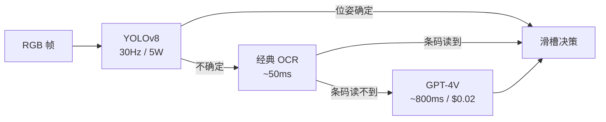

# 第 2 章 感知

> 第 1 章把“端到端 vs 分层”这把判断尺立了起来。这一章要把尺子压到感知模块上：2024 之后机器人能“看见”的东西，跟 2020 年完全不是一回事，但能不能信它，是另一回事。

---

不妨看看国内外仓储拣选车间里反复上演的一段工程演化。现场的任务，是把流水线传送带上送来的快递盒分类分拣到三个滑槽里；那些盒子姿态随机，此前从未见过。盒面上贴着五花八门的标签：DHL、顺丰、FedEx、SF Express、UPS，还有手写的私人地址。前一代系统用 YOLOv8 配上一个力闭环抓手，抓稳盒子不成问题，可究竟该送进哪个滑槽，全指望着条码扫描；一旦扫不到码，包裹就只能滑进兜底滑槽等人力二次分拣。跑下来，兜底滑槽每天大概要接走 18% 的件。

到了 2024 年，大家开始普遍尝试新的路子：直接把摄像头的 RGB 帧丢给 GPT-4V，问它“这个盒子应该走哪条线”。GPT-4V 扫上一眼，便能直接读出盒面上的中文地址、英文公司名与手写邮编，给出一个置信度合理的滑槽决策。18% 的兜底率应声跌到了 4%。可代价是单帧耗时多达 800 毫秒。传送带片刻不能停，工程上只得对 GPT-4V 做调用节流，前一段经典视觉给不出答案时才允许它触发。整条流水线自此变成一个三层栈：YOLOv8 抓盒子位姿，经典 OCR 读条码，GPT-4V 则专门处理“这玩意儿到底是什么”的尾部 case。

这就是 2024 之后机器人感知栈最典型的形状：经典感知做主干，VLM 处理尾部，谁也没能替代谁。看清这件事，是读懂这一章的核心判断。

```mermaid
flowchart LR
  IMG[RGB 帧] --> Y[YOLOv8<br/>30Hz / 5W]
  Y -->|位姿确定| OUT[滑槽决策]
  Y -->|不确定| O[经典 OCR<br/>~50ms]
  O -->|条码读到| OUT
  O -->|条码读不到| V[GPT-4V<br/>~800ms / $0.02]
  V --> OUT
```

---

先把 2010 年代的经典感知栈快速过上一遍，往后的讨论里，我们还要三番五次回头向它借照。

经典感知栈处理的核心问题，主要就是这么几个：

**Detection**：图像里究竟有什么、落在何处。这条路线一路从 R-CNN 系列（Girshick 2014）走到 Faster R-CNN（Ren 等，2015），再到 Redmon 起头、如今各方接棒演进至 v8、v9、v10 的 YOLO 家族，乃至 DETR（Carion 等，Facebook，2020）。这一线的输出是一堆带类别标签的 bounding box，支持的类别早在训练时便已固定下来，少则几十个，多则上千个。

**Segmentation**：每个像素到底属于哪一个物体。Mask R-CNN（He 等，2017）是公认的分水岭，此前占主流的是 FCN 与 U-Net 那一套。语义分割和实例分割分属两条脉络，工业现场真正吃紧的往往是后者。

**Depth estimation**：每个像素距离相机有多远。取法不外乎三种：要么靠双目（OAK-D、ZED、RealSense D435 这些设备直接给，两只眼做三角测量给出深度），要么靠 LiDAR（Velodyne、Hesai、Livox 这些激光雷达品牌），要么靠单目深度网络（这一线在 2024 之前始终不够稳）。在桌面机械臂场景里，最常见的标配是 RealSense D435 或 D455，能给出 30Hz 的稠密深度图，只是近距离挪到 15cm 以下，读数就再也信不得了。

**Pose estimation**：针对已知物体，估算它的 6-DoF 位姿（涵盖 x、y、z 平移加 roll、pitch、yaw 旋转，共六个数）。抓取能不能成，核心就在这一步。早年的经典手笔有 PoseCNN（Xiang 等，2018）与 DenseFusion（Wang 等，2019）；往后 FoundationPose（NVIDIA，2024）做到了对未见物体的零样本 pose estimation，算是这一线少数被 LLM 浪潮推着大步向前的工作。

**SLAM 前端**（边走边定位的几何骨架）：算出相机自己在世界里的位姿。ORB-SLAM3（Campos 等，2021）、视觉惯性紧耦合的 VINS-Fusion（HKUST，2018）、Kimera（MIT，2020）这一线在视觉惯性里跑了很久。室外大场景这两年固然被 Gaussian Splatting 类的 dense reconstruction 推了一把，但 SLAM 前端的位姿估计本身，眼下依然是 feature-based 的天下。

这套栈的每一块都足够成熟、都有 benchmark 可跑、都能踏实写进 unit test。它力所不及的地方第 1 章已经讲透：中间表示死死卡在固定类别的 bounding box 与深度图里，毫无语义弹性。你训出一个能识别 80 个 COCO 类的 detector，部署到家庭场景碰上一个“小米电饭煲”，它要么张冠李戴叫成 “microwave”，要么干脆丢出一个低置信度的 “appliance”，反正不会告诉你这玩意是煮饭的。这是经典感知栈与生俱来的硬限制，不是工程没打磨好，而是起步时的设定就注定了天花板。

---

2024 这一波带进来的几样新东西，不妨按顺序逐一点一下，每一样都讲透它到底真解决了什么、又真在哪些地方没解决。

**VLM 当感知接口**。GPT-4V（OpenAI，2023 年 9 月）、Claude 3 系列（Anthropic，2024 年 3 月起）、Gemini Pro Vision（Google，2024）、Qwen2-VL（阿里，2024）、InternVL（上海 AI Lab，2024）这一线把“看图说话”推上了通用水平。随手喂一张机器人摄像头的图，问一句“桌上有几个杯子？哪个是空的？”，拿到的回答已然堪用。这套本领在 2022 之前无处可寻，2023 还又贵又慢，直到 2024 中之后才算真正工业可用。但这种用法骨子里是在把 VLM 当作一个语义查询接口，绝非拿它当 detector。它给不出像素级精确的位置，给不出 6-DoF 位姿，给不出可重复的几何输出。硬把 VLM 抓去当 detector 来用，是过去一年里最常见的项目失败模式。

**开放词表检测**。OWL-ViT（Minderer 等，Google，2022）、GroundingDINO（IDEA，2023）、OWLv2（Google，2023）、YOLO-World（Tencent，2024）这一线的核心能力在于：只要你给一段文本 “red mug on the left”，它就能直接吐出 bounding box。它比 VLM 快出许多（GroundingDINO 在 RTX 4090 上能跑到 30Hz 量级），又比经典 detector 灵活太多。真落到生产环境里，撑起 2025 年大多数家庭与服务机器人感知栈的实际主力正是它，而不是名气更大的 GPT-4V。它是真把 detection 这件事的弹性买回来了。可它的失败模式同样明明白白：对极相似的物体（比如 “the small red mug” vs “the slightly bigger red mug”）分辨不开，面对一整桌密集小物体，框出来的结果更是一团凌乱。

**通用分割**。SAM（Kirillov 等，Meta，2023 年 4 月）和 SAM 2（Meta，2024 年 7 月）这一线买到了“对任意物体出 mask”的通用能力。SAM 2 的关键升级是把视频拉了进来，能够跨帧稳定跟踪一个 mask，这件事对机器人要紧得很，因为机器人的视野是连续的视频流，从来不是静态图。EfficientSAM（Meta，2024）、MobileSAM、FastSAM 则是为了在边缘设备上跑起来而衍生出的几条轻量优化线。SAM 把分割从一个需要标数据训模型的苦活，变成了一个只要给 prompt 就能交差的任务。这是质变。但 SAM 压根不知道自己分出来的是什么，它只管吐 mask，不给标签。所以在工业落地中，最常用的打法基本都是 GroundingDINO + SAM 串联：前者给框，后者把框变 mask。Grounded-SAM（IDEA，2023）正是这项工程组合的现成样板。

**通用深度**。Depth Anything（Yang 等，HKU + TikTok，2024 年 1 月）、Depth Anything V2（同组，2024 年 6 月）、从 2019 起一直在更新的 MiDaS（Intel），加上 ZoeDepth（Bhat 等，2023），构成了 2024 年最被低估的一股力量。在此之前，单目深度这件事在机器人里基本派不上用场，要么靠 RGB-D 相机，要么靠 LiDAR。直到 Depth Anything V2 训完之后，单目深度的相对精度才首次达到能在桌面任务里提供参考的水平。虽然绝对深度仍然不行，但拿来跟 RGB-D 相机融合做尺度对齐，在近距离杂乱场景下反而比纯 RGB-D 更鲁棒，因为 RGB-D 对透明物（玻璃杯、水）和高反光（不锈钢）全都会抓瞎。

**CLIP 嵌入当语义查询**。这套概念早在 2021 年 OpenAI 发 CLIP 那篇论文时就已立住，但直到 2023 之后才真正被机器人领域铺开来用。OpenScene（Peng 等，2023）、ConceptFusion（Jatavallabhula 等，MIT，2023）、LERF（Kerr 等，Berkeley，2023）这一线把 3D 场景每个点都关联上一个 CLIP 嵌入向量；运行期间只需递入一段文本（“the thing I would use to open a bottle”）做语义检索，就能直接锁定 3D 物理位置。这件事在经典栈里做不出来，因为经典栈压根没有“概念向量”这种中间表示。这一线在 2025 年虽然依然是研究多于部署，但已经能看出步入生产的确定轨迹，只因它解决的正是“用户在家随口说一句模糊的话，机器人能不能找到对应物体”这个核心场景问题。

把这五条加起来看，2024 之后机器人感知栈的实际形状已然清晰：经典 detector 处理 head，开放词表 detector 处理 mid-tail，VLM 处理 long-tail 和“这是什么意思”型查询，SAM 把框变 mask，Depth Anything 跟 RGB-D 融合补齐深度，CLIP 嵌入则当起语义检索的桥梁。彼此环环相扣，哪一项都没能真正替代谁。

---

触觉这条线要单拎出来讲，因为它跟视觉那条线的节奏完全不是一回事。

视觉感知在 2024 是公认的大年，触觉感知在 2024 却谈不上大年。但触觉这件事在机器人体系里的地位，反而在悄悄变得更重要。原因格外直接：端到端 VLA 在抓毛巾、抓水果、抓塑料袋这种形变物体上的每一次进步，都离不开触觉做底层反馈。

触觉传感器这两年真正值得点名的，也就是这么几条线：

**DIGIT**（Lambeta 等，Meta，2020）走的是 GelSight 的路子，胜在便宜。百美元级的成本，3D 打印的外壳，靠 LED 加上摄像头去捕捉硅胶受压时的形变，就拼成了一个指尖触觉传感器。Meta 随后把硬件设计与 SDK 全开源了。这颗传感器真正带出来的，是“触觉信号本质就是图像，可以直接喂给 CNN 或 transformer”这套范式。

**GelSight 系列**（MIT 起家，2017 年起一直迭代）算是这条路上的老资格。它比 DIGIT 出得早，分辨率更高，只是工艺复杂，身价也高得多。直到 2024 年 GelSight Mini 面世，才算把成本真正压了下来。

**ReSkin**（CMU，2021）换了一种打法，靠磁感应配上机器学习来做触觉皮肤，能直接贴在曲率很大的表面上。它和 GelSight 走的是截然不同的路子：GelSight 专攻指尖方寸之地的高分辨率，ReSkin 要的是大面积、低分辨率的整片覆盖。

**AnySkin**（NYU + Meta，2024）是 ReSkin 在工程上的正统继承人。它把标定这件事做到了“换一片皮就能继续用，不需要重新训练模型”。在触觉传感器走向产品化的漫长摸索里，这算得上一次少见的真进展。

Allegro Hand + Tactile 与 **LEAP Hand**（CMU，2023）代表着另一条思路：不再只盯指尖，而是把触觉传感器铺满整只灵巧手。至于老牌的 Shadow Robot Hand，性能固然在，价格却贵得让人望而却步。

触觉传感器迟迟没有迎来属于自己的爆发时刻，原因无非三条。第一是没有触觉版的 ImageNet。视觉感知能成气候，靠的是互联网上数亿张带标签的现成图片；触觉信号完全没有这等积累。各家传感器的输出格式各行其道，硅胶形变数据至今没有一套可供迁移的预训练基础。第二是仿真做不真。视觉跨越 sim2real 已经步履维艰，触觉的 sim2real 更是纯粹的学术难题，只因硅胶的接触力学根本写不出简明利落的可微物理模型。第三是没有拿出杀手级的 demo。视觉领域里 GPT-4V 一露面，人人都能看出价值所在；触觉领域至今拿不出一套“看一眼就懂”的演示，去说服外行投资人把钱投进来。

可端到端 VLA 无论如何绕不开触觉。π0 在 2024 年那段折衣服的 demo 里没有用触觉，全凭双臂视觉对夹的反馈来调整动作，这恰恰标出了它的能力边界。家务活里多的是单靠眼睛应付不来的场景：拧瓶盖得感知有没有“拧到位”，拿鸡蛋得知道手上是不是“握太紧”，叠衣服得摸得出到底“抓起了几层布”。2026 年之后这条路线如果要真正引爆，最可能的一幕，是某家团队把 DIGIT 这类传感器装上 LEAP Hand，第一次拿出双臂连续叠好几件不同质地衣物的完整 demo。在此之前，触觉在工程部署中的处境有些尴尬：大家都清楚离不开它，却还没人能讲明白到底该怎么用它。

---

多模态融合这件事，做错的人远比做对的人多。

机器人感知系统最后拿到手里的，从来不是单单一股信号，而是 30Hz 的 RGB 彩色图、30Hz 的 depth 深度图、100Hz 的触觉、1kHz 的关节角度与速度等本体感觉，外加 16kHz 甚至 48kHz 的麦克风音频。把这些统统丢给一个 transformer 让它自己琢磨融合，理论上听着省心。可直接把各路特征拼在一起（concat），恰恰是过去两年里最常见的设计误区。

这套做法的硬伤，清清楚楚摆在三处。

**频率不匹配**。直接把特征拼接起来，就必须强行把所有信号对齐到同一个时间步。最省事的做法，无非是把本体感觉和触觉这类高频数据，一路下采样削减到视觉惯用的 30Hz。可指尖触感里那些细微的高频颤动，本就指望靠高采样率抓取，这一降采样全给丢了个干净，连带着把当初引入触觉的初衷也一并扔掉了。

**分辨率不匹配**。RGB 画面是 H×W×3 的稠密矩阵，本体感觉却只有区区 7 个数字。若不做处理直接拼在一起，这 7 个数字在序列里转眼就被成千上万的图像 token 吞没，模型在训练时根本学不到本体感觉的权重。早在 RT-1 时代，Brohan 的团队就讨论过这个毛病；他们的办法是把本体感觉单独 token 化、单独做特征嵌入，各自过完 encoder 之后再去拼接。

**异构噪声**。视觉噪声来自光照变化与运动模糊，触觉噪声来自硅胶老化与温度漂移，本体感觉的杂音则来自关节编码器的累积误差。这几路信号的噪声分布天差地别，硬塞进同一个 dropout 或 normalization 层毫无道理可言。真正讲究的设计，是让每一路信号先在属于自己的 encoder 里老老实实走完归一化，再谈后续的融合。

这两年业内摸索出来的正规融合方案，基本收敛在三条路线上。第一条是 Per-modality encoder + cross-attention：各路信号各走各的 encoder，随后通过 cross-attention 把高频低维的信号“查询”并注入到视觉嵌入当中，Octo 选的就是这个方向。第二条是 Tokenize everything：将所有模态的输入分别切成统一长度的 token 序列，一股脑送进共享的 transformer 里，RT-2 便倾向这种做法。第三条是 Late fusion：各路信号各自算出一套动作分布，直到最后一层才做加权合并；这在工业现场更稳当，只是性能天花板偏低。

具体选哪一种，取决于下游任务究竟对哪一路信号最敏感。但有一条铁律放之皆准：必须先做 per-modality 归一化，然后再做融合。不经处理直接把特征硬拼在一起，不过是行业新手的一场毕业典礼。

---

接下来正面回答这一章最实操的问题：把 VLM 当作感知模块，背后到底要付出怎样的代价。

**延迟**。走 OpenAI API 调用一次 GPT-4V，耗时在 800 毫秒到 1.5 秒之间；Claude 3.5 与 4 系列到 2024 年底虽然压到了 400 到 700ms，Gemini 系列配合 Vertex AI 部署能做到 300 到 500ms，开源的 Qwen2-VL-7B 放在本地跑也能跑进 150 到 300ms，但只要任务循环要求 10Hz 的闭环（也就是一帧只有 100ms），上面这些数字就一个也派不上用场。VLM 在感知栈里的位置，注定只能做低频查询，担不起实时的闭环反馈。

**贵**。调用一次 GPT-4V 大概耗费 0.01 到 0.03 美元（取决于 token 数量）。按一台机器人每秒发起一次查询、一天运转 8 小时计算，每天单台花销在 0.3 到 1 美元。一旦铺开到一万台的规模，每天单是纯感知成本就高达三千到一万美元，而且这笔开销列在 BOM（物料清单）里，与硬件折旧完全是两码事。2024 年不少初创团队在算账时往往漏算了这笔账。把开源模型搬到本地运行确实能将调用开销压到接近零，可代价是团队得自己采购维护 GPU、供养专门的 inference 团队，还要忍受比调用 API 慢得多的算法迭代周期。

**对新颖姿态会幻觉**。这是 VLM 身上最容易被人轻视的失效隐患。给它一张端正摆放的杯子照片，它会告诉你这是杯子；换成一只倒扣在桌上的杯子，它依然告诉你这是杯子，可一旦追问“杯口朝哪边”，它便开始信口胡编。VLM 在训练数据里看过数十亿张直立杯子的照片，却极少见过倒扣的模样。偏偏机器人在实际作业中，最常碰到的就是训练数据中罕见的刁钻姿态：物体侧躺、部分遮挡、或是被别的物件死死压在底下。碰上这种场面，经典的 6-DoF pose estimator 要么干脆报错退出，要么给出一组错误的数值；VLM 却不同，它会面不改色地给出一个流畅、自信却荒谬的答案。在关乎安全的任务里，这种自信足以致命。

**无法做几何精确输出**。VLM 能轻巧地告诉你“杯子在桌子左边”，却无论如何交不出“杯子中心在相机坐标系下处于 (x=0.32, y=-0.15, z=0.78)”这样精确的空间坐标。想拿到机械臂真正能用的 6-DoF pose，终究得回到 FoundationPose、PoseCNN、ICP 这一套传统路数，或是用 GroundingDINO、SAM 加上 Depth Anything 拼凑出一套粗略的 6-DoF 位姿估算（也就是取 mask 的几何中心结合 depth 与相机内参 camera intrinsics 做反投影）。在这条处理链条里，VLM 适合待在上游：由它来指明该看哪一件物体，至于该物体在三维空间中具体落在何处，必须交由下游模块去解算。

---

把立场亮清楚。

凡是牵涉安全的 detection，千万不要全盘托付给 VLM。如果一次检测失误的代价是机器人撞上人、夹断手指或是砸坏贵重物体，现场就必须由经典 detector 牢牢兜底，并且由经典 detector 拍板最终决策，VLM 充其量只能充当语义上的辅助。理由正是前文提及的那种“流畅、自信却错误的答案”。一个传统的 YOLO detector 吐出 0.43 的置信度，你心里有数它吃不准，大可触发兜底逻辑；可当 VLM 给出“我看到那只猫在沙发上”时，背后根本没有一个数值 confidence 可读，你无从知晓它是真知道，还是信口胡编。

**语义 query** 才是真正属于 VLM 的用武之地。“用户口中那句‘那只大的’究竟指哪一个”、“眼前这件东西能不能进微波炉”、“地上这摊液体看起来像水还是像油”，这类开放的常识问题，经典的感知栈向来答不上来，VLM 却答得很好。只要把 VLM 限制在“开放语义解释”这个角色里，不让它做几何，不让它做安全决策，也不让它做闭环反馈，它就会是这一波感知栈里增量价值最高的一块拼图。

---

下面整理了一张实操选型表：面对具体任务，手头到底该配哪些感知组件。过去一年的工程实践里，这张表我自己用得格外顺手，列在这里，任凭你挑刺或是直接拿去下地干活。

| 任务类型 | 经典 detector | 开放词表 (GroundingDINO/OWLv2) | SAM/SAM2 | Depth Anything | RGB-D / LiDAR | VLM (GPT-4V/Claude/Gemini) | 6-DoF pose estimator | 触觉 |
|---|---|---|---|---|---|---|---|---|
| 流水线已知物体抓取 | 主力 |  |  |  | 主力 |  | 主力 |  |
| 家庭未见物体抓取 |  | 主力 | 主力 | 辅助 | 主力 | 语义解析 | 辅助 | 辅助 |
| 户外移动机器人导航 | 主力 |  |  | 辅助 | 主力 |  |  |  |
| 仓储分拣含手写标签 | 主力（盒检测） |  |  |  | 辅助 | 尾部 case |  |  |
| 折毛巾/叠衣服 |  | 辅助 | 辅助 |  | 主力 |  |  | 主力 |
| 倒水/拧瓶盖 |  |  |  |  | 辅助 |  | 主力 | 主力 |
| 用户口语指令找物体 |  | 主力 |  |  |  | 主力 |  |  |
| 安全相关接近人 | 主力 |  |  |  | 主力 |  |  |  |
| 语义场景理解（"厨房乱不乱"） |  |  |  |  |  | 主力 |  |  |
| 透明/反光物体抓取 |  | 辅助 | 辅助 | 主力 | 辅助 |  | 主力 | 辅助 |

看这张对照表的时候，有三处关窍要看清楚。第一，“主力”一列在同一行里经常同时出现两到三项，这意味着具体任务从来不能靠单打独斗，多模态融合才是常态。第二，“安全相关接近人”那一行里，VLM 对应的空格干干净净，这是有意留出来的空白。第三，“语义场景理解”那一行只有 VLM 当了主力，这准确标出了 VLM 在整个感知栈里真正的甜点位置。

---

不妨回头看看本章开头那个仓储分拣的例子。那套三层软件栈的架构分工格外分明：YOLOv8 负责圈出“盒子在哪”（经典 detector 主力），OCR 负责识别“条码是什么”（经典栈），GPT-4V 则接手“这件包裹是做什么的、地址写在哪里”（VLM 处理 long-tail 语义）。这样的架构不是照着哪本教科书生搬硬套出来的，而是在生产线上一路碰壁、交足了学费才慢慢收敛出的模样。把这套逻辑讲透，就是想让你少走这几个月的弯路。

从下一章开始，讨论的重心将从感知转向动作。面对的依然是同一把判断尺：哪些控制指令交给端到端 VLA，哪些动作交给经典控制器，哪些长程决策交给 LLM 充当 high-level planner。感知与动作的分工有着根本的不同：在感知领域，VLM 处理 long-tail 是实打实的新增能力；但在动作控制里，LLM 处理 long-tail 还远谈不上稳妥。这中间的曲折与代价，留到下一章细讲。

---

## 练习

把 SAM 的论文（Kirillov 等，2023）找出来再读一遍，但这回专门看它记录失败案例和失效条件的那几节。看看 Meta 自己究竟列出了几类失败模式，而这几类缺陷在你见过的机器人演示里有没有露过破绽。假如有，当时的系统又是用什么手段把问题绕过去的。

找一段你最近看过的家庭机器人演示视频，把画面里每一个清晰的感知动作逐一拆解出来，记录机器人具体识别了什么、定位了什么、做出了怎样的判断。试着给每一个步骤贴上对应的标签：经典 detector、开放词表、SAM、VLM、6-DoF pose，还是“不知道”。那些你只能标上“不知道”的步骤，往往正是演示视频在宣传上有意对你藏起来的部分。

翻开 Depth Anything V2 的论文，这次只读它与 MiDaS、ZoeDepth 相互对比的那几张表格。具体到家庭机器人最常见的桌面操作距离（30cm 到 1.5m），细看这几个模型到底谁给出的深度更准。面对这些实测数字，你以往对单目深度估计所建立的印象，又有多少需要就此更新。

找出一篇常被视作端到端 VLA 代表作的论文（π0、OpenVLA 或 Helix 均可），仔细推敲其中的系统架构图与输入规格说明。看看模型的输入通道当真只有原始 RGB 图像，还是塞进了 depth、proprioception 甚至触觉信号。只要输入不单是纯视觉，系统在感知前端其实就已经完成了 per-modality encoding，算不上真正意义上“像素直通电机”的纯粹端到端。把这个技术细节与它们对外给出的公开叙述对照来看，两者是否当真严丝合缝。

下一章：[第 3 章 动作](03-action.md)
