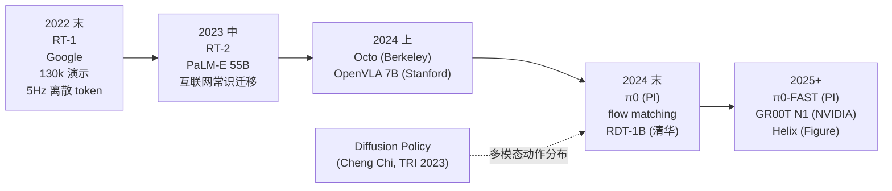

# 第 3 章 动作

> 无论感知多模态模型如何敏锐地解析视觉流形、高层规划器如何严谨地构建推理因果链，系统最终都必须将认知坍缩为数十个高频浮点数，直接作用于物理电机的力矩与位移回路。**动作输出层的结构设计是端到端控制中最容易被忽视的咽喉要道**，也是决定通用具身模型能否真正跨越物理门槛的核心战场。

---

在具身机器人的研发日志中，曾记录过这样一段具有代表性的双臂折叠衣物测试：视频初始阶段极为顺畅，双臂协同捏住领口两侧并轻轻抖动铺平，随即向中心轴线对折。然而，在进入中段折叠的微调区间时，机械臂的运动轨迹突然陷入剧烈的离散抖动，动作表现出周期性的停滞与脉冲式跳跃，原本规整的织物在突变的作用力下被揉搓成杂乱的褶皱。

硬件链路与 1kHz 底层力矩伺服回路经过校准均无异常，故障的根源完全深植于策略网络的动作解码层。

在该版本的 VLA 架构中，动作空间被映射为 7-DoF 关节自由度的离散 Token 集合，每个关节区间被粗糙地均匀量化为 256 个 Bin；模型以 5Hz 的低频输出动作块（Action Chunk），下游控制器则通过零阶保持器（Zero-Order Hold, ZOH）将指令强行拉伸至伺服电机的控制周期。**5Hz 的离散阶跃指令与 1kHz 的连续物理伺服回路产生剧烈干涉，导致了肉眼可见的机械抖动**。相邻 Bin 之间对应的关节转角跃变往往超过 1 度，这一离散阶跃被底层电机在数百毫秒内硬性拉伸到位并锁死，直到下一个推理周期的离散 Token 再次引发新的瞬态冲击。

这一现象揭示了早期端到端模型的固有缺陷：将动作空间过度简化为类似离散语言的 Token 序列，在宏观大幅度移动中尚可掩盖，但在毫米级顺应性接触任务中必然遭遇物理阻断。**动作空间的表示形式、解码带宽与时间粒度，从根本上锁定了机器人所能执行的物理任务上限**。

---

### 动作空间表征的维度与权衡

在策略网络输出端，动作空间的数学表达通常有以下几种经典形态：

**关节绝对位置（Joint Position）**：网络直接回归各个关节的目标角度向量 $q \in \mathbb{R}^n$。其优势在于与底层 PD 控制器解耦极小，可直接作为期望设定点输入驱动层。其劣势在于强行迫使神经网络隐式求解整机的正逆运动学（Forward/Inverse Kinematics），高维非线性坐标变换显著降低了样本学习效率。

**末端笛卡尔位姿（End-Effector Pose）**：输出机械臂末端在空间中的 $SE(3)$ 变换（3 维平移与 3 维旋转参数），由下游逆运动学（IK）数值求解器解算为各关节角度。该表征与摄像头的笛卡尔视觉流形天然对齐，几何语义直观；但受限于机械臂的工作空间约束、奇异点（Singularity）以及逆运动学的多解性与解跳跃风险。

**相对增量位姿（Delta Pose）**：网络预测当前末端位姿到下一离散时间步的相对偏移量 $\Delta x$。该表征大幅收敛了输出空间的数值分布范围，在行为克隆（Behavior Cloning）中表现出极佳的局部泛化性能，成为 RT 系列与主流开源 VLA 的标准选型。然而其核心痛点在于**开环时间积分下的漂移累积**：在数十秒的长序列中，微小的单步预测偏差会随时间呈几何级数发散。

**关节速度与广义力矩（Velocity & Torque）**：直接输出关节角速度 $\dot{q}$ 或关节广义力矩 $\tau$。由于人类遥操作示教设备天然采集的是位置与位姿流，数值微分计算出的速度与力矩伴随高频噪声，使得力矩级端到端模仿学习在实机上极难稳定收敛。

在工业与学术实践中，**末端增量位姿协同夹爪开合度的复合空间（$6+1$ 维）构成了事实上的主流基准**。这一选型并非理论上的最优解，而是由当前遥操作示教工具链（如 SpaceMouse、动捕手柄及主从机械臂）的输出格式所共同决定的工程妥协。

---

### 离散 Token 与连续流匹配的范式分野

围绕动作解码架构，学术界与工业界经历了从离散量化到连续流生成的深刻演进：

RT-1 与 RT-2 代表了离散 Token 路线：将每一维动作划分为 256 个等间距区间，整组动作被统一编码为离散 Token 序列，与自然语言 Token 共享相同的自回归 Transformer 解码结构。这一设计的核心优势在于**将动作与文本表征统一于同构的词表空间，直接复用海量互联网图文预训练权重**。

然而，其物理代价是对连续动力学流形的强行离散化。256 个 Bin 抹杀了微观接触所需的平滑调节能力，且自回归预测难以施加二阶导数连续性（加速度平滑）先验约束。

π0 则转向了连续流匹配（Flow Matching）与扩散模型范式：网络学习从高维先验先导噪声流向真实动作轨迹的连续向量场。其输出不再是单步离散符号，而是在连续欧氏空间中直接积分采样生成一段高维连续轨迹块（Action Chunk）。流匹配在保持多模态动作分布拟合能力的同时，兼具比传统扩散模型更快的采样收敛速度，在双臂协同折叠等高动态柔性操纵中展现出优异的轨迹连续性。

π0-FAST 则尝试在频域离散与并行解码之间寻求折中：通过离散余弦变换（DCT）与类似 BPE 的压缩算法降低动作序列维度，并结合动态规划并行展开多步动作，将连续策略的闭环推理频率推高至 30Hz 以上，在模型容量与推理延迟之间取得了工程平衡。

当前的技术演进已达成清晰共识：**粗糙的单步离散 Token 预测正在被边缘化，基于连续流匹配、扩散动作头或频域压缩的连续轨迹生成已成为高性能 VLA 的核心支柱**。

---

### 控制频率与物理接触的时间尺度

控制频率的选型本质上取决于物理接触过程中力学状态变化的时间常数：

**5Hz 离散区间（宏观无约束运动）**：适用于抓取刚体几何块、开启抽屉等大幅度位移场景。此类任务的接触瞬态极短，下游控制器可通过样条插值完成宏观运动平滑。

**30Hz 标准基准（连续几何自适应）**：织物平整、包裹装配与双臂协同的黄金频率区间。主流边缘算力平台（如 NVIDIA Orin / Thor）能够稳定维系 7B 级多模态模型的 30Hz 流式推理，动作轨迹在宏观尺度上已具备足够的流形连续性。

**50Hz 至 100Hz（轻微受约束接触）**：进入轻度接触力学与微小滑动摩擦的调控区间，如紧密插拔与轴孔预装配。

**200Hz（高频力敏感交互）**：液体倾倒液位平衡、易碎薄壁容器捏持、剥离胶带等操作中，接触应力变化处于毫秒级尺度。由于大参数量网络无法在车载算力上实现 200Hz 的前向传播，工程上必须采用**上层 30Hz VLA 提供名义期望位姿轨迹，底层 200Hz 导纳/阻抗控制器（Admittance/Impedance Control）实时调制接触力**的分层拓扑。

**1kHz（确定性驱动与抑振）**：底层电机电流环、关节力矩闭环与机械共振抑制的确定性控制域。该层级完全由经典实时嵌入式控制器主导，神经策略通过上层设定点对其施加间接引导，严禁试图由深度网络直接接管 1kHz 伺服中断。

---

### 多模态动作分布与损失函数的本质重构

在经典的自然语言模型中，交叉熵损失（Cross-Entropy Loss）用于拟合离散词表上的极大似然估计。

然而在物理动作生成中，**同一物理初始状态往往对应着多条拓扑完全不同但均有效的连续操作轨迹**。以将桌面水杯移动至对侧为例，机械臂既可沿直线水平推移，亦可向上抬起避开障碍物后平稳放下，或从侧翼绕行动作。这两类动作流形在状态空间中构成了多峰分布（Multimodal Distribution）。

若采用传统的均方误差（MSE）对单一确定性网络进行回归训练，损失函数的优化目标将迫使预测结果收敛至多条有效轨迹的代数均值：生成一条中间下沉、速度突变且在物理上不可行的病态折中路径。

Diffusion Policy 与 Flow Matching 的核心贡献，在于从数学上重构了动作生成的学习目标：**模型不再拟合单一均值，而是学习完整的高维多峰动作概率密度流形**。采样过程从该流形中提取出一条自洽、平滑且在物理意义上完全合法的具体轨迹，从根本上消除了回归均值带来的行为畸变。

---

### 动作分块与滚动时域控制

在长序列行为克隆中，两项核心算法技巧构成了现代动作生成的基础标准：

**动作分块（Action Chunking）**：策略网络单次前向推理不再预测单步动作，而是并行生成覆盖未来 $T$ 个时间步的轨迹块（例如预测未来 50 步，对应 1 秒时域）。其深层价值在于**阻断行为克隆中的单步自回归累积复合误差（Compounding Error）**。网络仅在 Chunk 初始点执行一次因果决策，后续状态沿生成的局部轨迹平滑展开，大幅削弱了每一步高频微小扰动导致的策略漂移。

**滚动时域控制（Receding Horizon Control, RHC）**：在执行动作 Chunk 时，系统并不完全消耗全部 50 步，而是在执行前 $K$ 步（通常为 8 至 16 步）后即刻截断，并结合最新观测传感器数据触发新一轮 Chunk 预测。该机制兼顾了轨迹生成的时间连贯性与外界扰动下的闭环动态修正能力。

---

### 动作抽象层级与工程收敛

动作生成架构的选型，本质上是对系统分层粒度的二次求精：

1. **纯离散 Token + 5Hz 架构**：将动作抽象完全并入多模态自回归，缺乏动力学连续性保障，仅在低接触、高容错的简单抓取中有效。
2. **Flow Matching / Diffusion + 30Hz + Chunking**：在动作生成内部建立隐式轨迹时域分层，当前在连续操纵任务中表现最佳。
3. **VLA 30Hz 位姿期望 + 经典阻抗控制 200Hz/1kHz 闭环**：通过显式控制分层隔绝力矩风险，是工业落地的黄金标准。
4. **层次化语言动作抽象（如 RT-Trajectory / RT-H）**：引入中间几何草图或高层动作谓词，在解释性与模块复用上展现出独特潜力。

在实际工程落地中，动作架构的选型必须与底层控制器的采样带宽精密匹配：倘若上层 VLA 以 30Hz 生成包含丰富高频特征的动作 Chunk，而底层逆运动学与插值模块仅工作在 5Hz，系统将丢失绝大部分连续性信息。**动作输出层不仅是一个算法网络头，更是连接数字潜空间与真实物理动力学的阻抗匹配接口**。

---

## 练习

1. **分析实机演示中的速度与加速度曲线**：选取一段开源 VLA 的实机操作视频，观察机械臂末端与夹爪在关键接触节点的运动连续性。定位其速度突变点，分析该不连续性源于网络 Chunk 的时间拼接边界，还是逆运动学奇异点带来的关节角突变？
2. **比较离散与连续动作表征的拟合损失**：对比 RT-1（256-Bin Tokenization）与 π0（Flow Matching）在柔性织物平整任务中的动作建模差异，从连续动力学与样本复杂度的角度推演二者的理论收敛上界。
3. **推演多模态动作分布的数学本质**：研读 Diffusion Policy 文献中关于多峰动作分布的论述，分析为什么在存在双向避障路径的场景下，基于 MSE 损失的直接回归策略必然导致机械臂在两条合法路径的中心线发生阻滞停顿？
4. **校验控制流水线的时间常数与带宽对齐**：核算你当前系统中的动作输出维度、VLA 推理频率、Chunk 窗口长度、通信延迟以及底层控制器频率。评估各环节是否存在显著的信息截断与时钟域漂移。

下一章：[第 4 章 抓取](04-manipulation.md)

