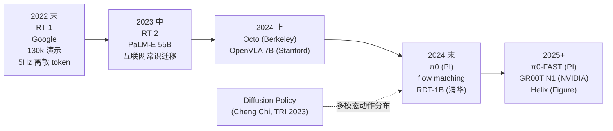

# 第 3 章 动作

> 神经网络看得再准、盘算得再周全，归根结底都得化成几十个数字打到电机上。动作输出层向来是端到端这条路线上最容易被低估的地方，也是 2024 到 2025 年这轮 VLA 真正分出胜负的战场。

---

2024 年中流出过一段双臂折 T 恤的内部视频。刚开头顺理成章，机械臂抓住领口，抖了一下展平，开始往中间折叠。折到一半动作突然诡异起来：手臂不再平滑地往内收，而是一抽一顿地打颤，每隔大约 200 毫秒才挪上一小步，像帕金森晚期的病人。T 恤最终被它折成了一团揉皱的东西。

机械本体挑不出毛病，1kHz 力控（按力的目标值闭环）测试早就顺当通过。问题全出在网络这一头。

那一版 VLA 输出的是 7-DoF（七个关节自由度）动作的离散 token，每个关节各划出 256 个 bin。模型以 5Hz 的频率吐出动作 chunk（一次推理出一段连续动作），下游只靠一个简陋的 zero-order hold（保持上一帧值不变）硬撑到电机的控制频率。当 5Hz 的离散指令直愣愣撞上 1kHz 的伺服回路，肉眼看去自然像在抽搐。相邻 bin 对应的实际关节角足足差了 1.4 度，电机在 200 毫秒里把这一步生硬拉过去，定死，等下一个 token 到了再硬拽一次。

这绝不是孤例。从 RT-1 这一脉顺流而下，凡是把动作切成离散 token 喂进 transformer 的尝试，走到精细操作面前无一例外都要撞墙。问题不在于网络聪不聪明，动作输出层的频率与粒度，早在物理规律上定死了这台机器究竟能接下哪类任务。2023 年还少有人认真琢磨这个关口，直到 2024 年下半年 π0 问世，它才真正成了业内绕不开的主流话题。

---

先把动作空间的几种选法摊在台面上。

**关节角（joint position）**。直接输出每个关节的目标角度。优点是同底层控制器的接口最干净，算出来直接送进 PD 控制器（按位置误差比例-微分反馈）便算交差。缺点在于网络得自个儿吃透整台机器人的运动学，单是一句“我要把手伸到杯子前”，就得在肚子里折算成 7 个关节各自要转动的度数。这种映射绕得厉害，吃起数据来效率极低。

**末端位姿（end-effector pose，机械臂最末端工具的位置加朝向）**。输出 6-DoF（三个平移加三个旋转）末端的位置与姿态，全交由下游的 IK 求解器解算为关节角。优点是天生同视觉空间对齐，“杯子在那里”与“末端移到那里”处在同一套坐标系里。缺点则全堆在下游：IK 求解常会遇上奇异点与多解问题，机械臂自身的物理构型也会反过来卡死动作。

**Delta（增量）**。只输出当前末端位姿到下一帧的微小增量。优点在于网络只需学着做局部修正，数据分布收得更窄，泛化表现也更扎实，RT-1、RT-2 与 OpenVLA 等主流模型走的都是这条路。缺点则是误差难免层层累积。一段 30 秒的动作要压上 600 帧 delta，即便每帧只偏差 1mm，一路叠下来也是足足 60cm 的惊人误差。

**关节速度 / 力矩**。直接输出 dq/dt 或 tau。端到端这条路线上几乎没人敢开这个口子，根源在于 teleop 采集到的天然就是位置数据，强行倒腾成速度或力矩，算不准也稳不住。Diffusion Policy 那一派偶尔在 sim 里试上一试，真机上几乎见不到踪影。

真到了实际部署，大家最常选的还是 6 + 1 维的末端 delta 搭配夹爪开合度，π0、OpenVLA、Octo 默认都按这个来。倒不是因为这个方案有多高明，纯粹是它同市面上主流 teleop 设备（Vive tracker、SpaceMouse、双手控制器）的输出最合得来。这是一个被现成工具链牢牢锁死的默认配置，从来不是什么经受住充分实验检验的最优解。

---

不妨再把目光拉回到 RT-1 与 π0 之间那场最具体的分歧上。

RT-1（Brohan 等，Google，2022 年底）选了离散 token 这条路：把每一维动作切成 256 个 bin，整条 action 凑成 7 个 token，像处理普通语言 token 一样喂给 transformer。这套设计的诱惑力显而易见：动作和语言共用同一种表示，就能直接塞进同一个 transformer，顺理成章地吃上同一套预训练红利。到了 RT-2，这套思路被推到了头，直接复用 PaLM-E 的词表，把动作 token 强塞进去做 fine-tune。

这么做的代价，是原本平滑的连续控制被生生切成了碎片。256 个 bin 放在大开大合的粗放移动里尚能应付，一碰上 1mm 级别的精细活计就捉襟见肘。更麻烦的是 token 之间毫无平滑约束，前后两步预测随时可能猛跳一下。工程师只能在下游靠 chunk 配合 interpolation 勉强兜底，可这一兜，动作自带的速度信息也就跟着丢光了。

π0（Physical Intelligence，2024 年 10 月）挑了一条截然相反的路：守住连续动作，靠 flow matching（学一条把噪声“流”成动作的连续路径）来输出。模型每走一步推理，吐出来的不再是零散 token，而是一整段连续的 action chunk（通常 50 步动作，对应 1 秒），直接在连续空间里完成采样。比起 diffusion（这里指用扩散模型生成动作轨迹），flow matching 收敛更快；比起生硬的直接回归，它又能稳稳拿捏多模态分布。凭着这手功夫，双臂折衣服的现场录出了第一段让行内外都觉得“这真不像 demo”的视频。

到了 2025 年初，π0-FAST（PI，2025 年初）又转过头来给离散 token 打补丁：借助频域离散化（DCT，离散余弦变换之上做 BPE-like 压缩，即类似语言里子词合并的方式），把同样长度的动作 chunk 压缩进更少的 token 里，再搭配 inference dynamic programming（IDP，用动态规划在推理时并行展开多步）做并行解码，一口气将推理频率从 π0 的 ~10Hz 拉升到了 30Hz+。这招说到底，是捏着鼻子承认纯连续 flow matching 推理太慢，却又打心底里不想退回 RT-2 那种粗糙的离散老路。

站在 2026 年初打量这场争论的结局，局面已经相当明朗：纯离散 token 早已退居次席，主流阵地要么被连续 flow / diffusion（π0、Diffusion Policy 系）占据，要么倒向频域离散搭配并行解码（π0-FAST 系）。至于 RT-2 当年那种最原始的 256-bin token 路线，只要碰上精细操作，基本已被挤到了聚光灯之外。

---

控制频率这一栏，得单独拎出来谈谈。

**5Hz**。RT-1 与 RT-2 的默认档位。能做的事：抓取刚性物体、按按钮、拉开抽屉、打开微波炉门。这些动作与物体的接触发生在一瞬间，大半时间都在跑大幅度的空载位移，5Hz 的指令配上下游平滑滤波尽够应付。做不了的事：任何带有持续接触、物体形变或对力反馈敏感的操作。

**30Hz**。OpenVLA、π0-FAST、Octo 所处的主流频率。能做的事：折毛巾、叠衣服、把东西塞进盒子里、双臂协同作业。30Hz 称得上是 2026 年的工程甜点。7B-级模型在 H100 或 Orin 上刚好能稳稳跑到这个帧率，绝大多数家庭与实验室环境下的任务，放在 30Hz 面前也完全看不出“抽搐”的痕迹。

**50-100Hz**。Diffusion Policy 在 sim 里常用的档位。到了这个频率，机械臂开始能够应付轻度接触的装配作业与力控插销。

**200Hz**。高频接触类精细操作的及格线。磕破生鸡蛋、剥开香蕉皮、撕下一截胶带，手指与物体之间的受力变化全在毫秒之间，5Hz 甚至 30Hz 根本抓不住这样细碎的时间尺度。眼下几乎没有哪个 VLA 能在这个档位上跑稳，工程师通常的解法，是由底层的 30Hz VLA 输出 setpoint，顶层再套上一层 200Hz 的 impedance / admittance 控制器（让机械臂像弹簧一样按力顺应环境）。

**1kHz**。传统力控、阻抗控制与抑振的领地。现阶段的 VLA 绝不直接输出这一层，这里向来是经典控制器掌管的地盘。VLA 只能在上层借由 setpoint 施加间接影响，至于把神经网络的 forward pass 硬顶到 1kHz，从来都是不切实际的念头。

在这些档位之间做取舍，说白了就看一条：你的任务里“从接触发生到做出反应”究竟需要多快的时间尺度。拉开抽屉是秒级，叠整毛巾是百毫秒级，磕破鸡蛋则是十毫秒级。任务本身的接触特征划定了控制频率的下限，控制频率又反过来定死了动作输出层的设计。这条环环相扣的推理链在光鲜的 demo video 里向来隐而不见，不少做家庭机器人的初创团队也正是在选型时栽在了这里。

---

把 VLA 这条线从 2022 到 2026 年的发展谱系，按着时间与技术分支顺下来排一排。

**RT-1（Google，Brohan 等，2022 年底）**：130k teleop 数据，离散 token，5Hz。一手立起了“端到端 VLA”的基本范式。

**RT-2（Google，2023 年中）**：基于 PaLM-E 55B 做 fine-tune，把互联网海量图文沉淀下来的常识引进了 action prediction。机器第一次学会了对从未见过的物体做出合情合理的动作。

**Octo（Berkeley，2024 年初）**：transformer 主干加上 diffusion action head，参数量 95M。代码开源且易于 fine-tune，很快在学术界铺了开来。

**OpenVLA（Stanford，2024 年中）**：7B 参数，基于 Llama-2 + DINOv2 + SigLIP，在 Open X-Embodiment 数据集上完成训练。这是第一个拿得出手的开源 VLA，也是 2024 下半年到 2025 上半年多数学术团队做 fine-tune 的起步底座。

**π0（Physical Intelligence，2024 年 10 月）**：主打连续动作与 flow matching，参数量 3B。双臂折衣服、收拾餐桌的录像，是这一轮 demo 里第一段公认“不像剪辑”的实打实记录。

**π0-FAST（PI，2025 年初）**：采用频域离散加 IDP，硬生生把推理频率给提了上去。

**RDT-1B（清华，2024 年中）**：1B 参数的双臂 diffusion 策略，国内最早一批正经开源的 VLA。在双手协同任务上表现可圈可点，是国内做仿生抓取那一批研究者手头常用的底座。

**GR00T N1（NVIDIA，2025 年）**：走 humanoid 通用基础模型路线。野心是做出“任何人形机器人下载就能跑的预训练权重”。系统设计上能明显看出是 system 1 + system 2 双层结构。

**Helix（Figure，2024-2025）**：宣称是“第一个能给 humanoid 上半身做端到端控制的 VLA”。这篇 paper 的行文带着浓厚的宣传色彩，但翻看其中 system 1 / system 2 的拆分方式，其实早就暴露出它并非纯粹的端到端。

**Diffusion Policy（Cheng Chi 等，Toyota Research，2023）**：严格说来，它其实算不上 VLA，里头根本没有 language。但它结结实实立在动作输出层最要紧的位置上：用扩散模型生成 action chunk，第一次把一件事挑明：动作分布本来就是多模态的，硬去回归一个均值从一开始就错了。这个洞见后来被 π0 拿去，做成了 flow matching 的主干。

---

扩散和 flow matching 为什么在动作上走得通，又为什么同语言模型分了岔，道理全在数据本身的性质上。

语言模型用 cross-entropy loss 回归下一个 token，底子里是在离散分布上做 MLE。这套做法在语言上行得通，因为语言 token 天生就是离散的，词表也是有限的。

动作就完全是另一回事。同一个状态摆在眼前，对的动作通常不止一个。要把杯子从左边拿到右边，你可以走一条直线，可以绕一道弧，也可以先抬高再放下，这三条轨迹全是对的。要是用 MSE 去回归一个动作均值，模型输出的就会是三条轨迹的平均值，落成一条不平滑也不实用的折中轨迹。这是 behavior cloning 里的老毛病，不是 VLA 冒出来之后才有的。

扩散和 flow matching 天生就能建模多模态分布。给它一个状态，它输出的是一整个分布，由着你从里头采样一条具体的轨迹。究竟抽中哪一条并不要紧，要紧的是采出来的每一条自身都是合理的动作，而不是几条合理动作混在一起算出来的平均值。

这就是 Diffusion Policy 那篇 paper 真正的贡献。它最大的价值不在于引入一个新模型，而是指出了要害：动作回归的损失函数从一开始就选错了。这件事后来被 π0 接了过去，做成 VLA 的主干，整个 2024 年下半年的工作也全顺着这条线铺开。

---

这里顺手提两个工程上的把戏，后面几章还会反复同它们打交道。

**动作 chunking**。一次推理直接输出多步动作，不再只给单步。RT-1 一次走 1 步，π0 一次给 50 步（对应 1 秒）。这事是 ALOHA / ACT 那篇 paper（Stanford / Tony Zhao，2023）做出来的。chunking 的真正价值从来不是省推理算力，而是绕开 behavior cloning 的复合误差。一次规划 50 步，模型只需要在 chunk 起点做一次“我要往哪走”的决断，中间 49 步沿着 chunk 走下去，不至于因为每一步都要重新做决策而一路漂走。

**Receding horizon control（滚动时域控制，预测一段、只走一段、再重预测）**。这是给 chunking 配套的执行策略：每次预测 50 步，但真正执行时只走前面的 K 步（通常 8-16），随后重新预测。这样一来，chunk 带来的稳定性保住了，模型也能根据新拿到的观测随时修正后续动作。这个名字是从 MPC 借来的，思路也是 MPC 那一脉。

这两个把戏现在成了 VLA 的标配。任何一篇严肃的 VLA paper 要是不写这两件事，都说明底层的工程根本没做到位。

---

“动作之上加层”是 2024 年另一条值得拿出来说的小分支。

**RT-Trajectory（Google，2024）**：这项工作发现端到端 VLA 学不会复杂的几何轨迹（比如沿着圆弧画一个图案），于是换了个办法：先用一个轻量模型生成 2D 轨迹草图，再让 VLA 沿着草图去执行。这在底子上是把“动作生成”拆成了“轨迹生成 + 轨迹跟踪”两层。早在 2010 年代，这种拆分原本是经典控制栈的标配，RT-Trajectory 算是端到端这条线上第一次回过头承认这层结构有用。

**RT-H（Google，2024）**：在动作之上加了一层“语言 hierarchy”。具体动作之上多出了一个用语言描述的“运动概要”层（move arm forward, close gripper）。多了这一层，人能看明白模型究竟在干什么，到了 fine-tune 的时候也能直接拿文本数据来做补强。

把这两个工作放在一起看，传递出的信号很明确：端到端模型一旦走到某个复杂度关口，终究得重新引入中间表示，只是中间表示长成什么模样还没形成定论。RT-Trajectory 走的是几何中间层，RT-H 走的是语言中间层，π0 那一线用的则是隐式的 chunk 中间层。三条路眼下都还在往前跑。

---

把这一章同第 1 章接上。

第 1 章那张端到端 vs 分层判断表里，最要紧的两行是持续时间和失败代价。到了这一章，我们其实是在更细的尺度上重复同一个判断：动作输出层选什么方案，本质上也是分层粒度的选择。

纯离散 token + 5Hz：相当于在动作输出层完全不分层，把所有控制责任全压给一个网络。这种选择只在大幅度、低接触、容错高的任务上行得通。

flow matching + 30Hz + chunking：动作内部已经有了隐式分层，chunk 起点负责高层决策，chunk 内 50 步负责底层展开。这是当前的 SOTA。

VLA 出 30Hz setpoint + 底层 200Hz/1kHz 经典控制器：这是显式分层，VLA 完全不碰力控。这是工业部署里的事实标准。

VLA 出语言级动作描述 + 下层小策略执行（RT-H 路数）：在动作语义上做分层。目前还在实验阶段。

没有一种动作输出方案是能够包打一切的。哪怕在同一家公司内部，家庭场景选第三种，仓库场景换第二种，研究 demo 又用回第一种。这件事跟“端到端 vs 分层”在大尺度上要做的判断一样：先看任务，再选层数，再定每一层具体的做法。

回过头看本章开头那个动作抽搐的折 T 恤 demo，后来的救法很干脆：把动作头从 RT-1 风格的离散 token 换成 Diffusion Policy 的 chunk 输出，频率从 5Hz 提到 30Hz，下游再接上 100Hz 的 admittance 控制器去吃掉接触力。用的还是同一组数据，站着的还是同一台机器人，第二个版本的视频里已经看不出任何抽搐。

这从来不是网络本身的问题，而是动作输出层上一道实打实的工程问题。直到 2026 年，同样的错误依然在被反复地犯。

---

## 练习

找一段你看过的 VLA demo 视频，盯着机械臂运动的速度曲线看 30 秒。留意哪一段动作出现了明显的不连续：究竟是在夹爪闭合的瞬间，还是在运动轨迹的某个中间点？再去对照这个不连续点究竟对应着动作头的 chunk 边界，还是某个具体的 token 跳变。

找 RT-1 和 π0 各一篇 paper，单读 action representation 这一节。RT-1 用的是 256-bin tokenization，π0 用的是 flow matching。把两者在折毛巾这类任务上的优劣写下来，列出三条以内。要是写不出三条，说明你对这类任务里的接触特征理解得还不够深。

把 Diffusion Policy 那篇 paper 翻出来，只看 figure 1 那张 multimodal action 的图。接着找一篇 2018 年之前的 behavior cloning 老 paper，看它当年怎么处理多模态。最后用一句话总结两种处理方式最核心的差距。

**在你自己的项目里**（如果你正在做 VLA 或者打算做），列出你的动作空间、频率、chunk 长度、下游控制器频率这四个数字，看看彼此能不能对得上。最典型的失败案例，是让 VLA 以 30Hz 输出长度 1 秒的 chunk，下游却只接了一个 5Hz 的 IK 求解器。在这样的组合下，chunk 内部 96% 的信息都会被白白丢掉。

下一章：[第 4 章 抓取](04-manipulation.md)
