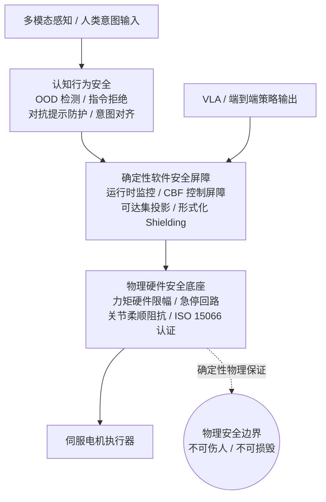

# 第 10 章 安全

> 将纯文本大语言模型的“价值观对齐（Alignment）”直接等同于具身智能的系统安全，是近年来最危险的概念借用之一。一台自重达数十公斤的人形机械臂，其在物理世界中造成实质伤害的动力学方式与文字输出的逻辑偏差处于截然不同的维度；具身安全工程所要解决的，是一套严密的物理防御体系。

---

不妨设想一个具体的家庭服务场景：一台身高 1.7 米、自重 60 公斤的人形机器人，在厨房环境中执行“递送热咖啡”的任务。目标用户斜倚在沙发上休息，手臂自然垂落，遮挡了多模态感知策略中关于“伸手接物”的标准视觉模板。策略网络随即滑入分布外（OOD）区域，前向推断生成了一条自上而下贴近人体躯干的送杯轨迹。

在机械运动学解析与关节限位校验中，该轨迹完全合规；自碰撞干涉检测顺利通过，底层轨迹规划器未触发任何软硬件报警。然而在现实物理世界中，杯中 80℃ 的高温液体势必因微小加速度而在贴近人体的瞬态泼溅倾覆。

整个动作过程不过两秒。纯文本层面的意图对齐与敏感词审查机制在此过程中全然无法介入，因为这并非符号层面的意图恶意，而是一个**纯粹的动力学物理事件**。应对该风险的真实防线，是底层关节力矩硬限幅、高频笛卡尔阻抗控制、运行时可达集监控以及独立的硬件级安全 PLC（Safety-rated PLC）。

具身安全并非自然语言对齐的简单延伸，而是由三层异构约束共同构筑的防御纵深：**硬件层面的能量与力矩物理屏障、软件层面的确定性运行时屏障，以及认知层面的语义意图安全**。

---

### 具身安全的三重防御纵深

构建高可靠具身系统，必须在架构层面清晰解耦三类性质各异的安全机制：

**物理与硬件安全（Hardware-level Safety）**：系统在最坏物理工况下是否具备不可抗拒的机械自毁或伤害抑制能力。这包含确定性力矩硬限幅（Torque Limit）、关节物理顺应性（Joint Compliance）、笛卡尔阻抗控制、急停回路（E-stop）、过流硬件断电及独立安全控制器（Safety PLC）。该层依托 ISO 10218（工业机器人安全）、ISO/TS 15066（人机协作功率与压力限值）及 ISO 13482（服务机器人安全）等工业标准，是历经数十年工业验证的确定性安全底座，不依赖任何神经网络的概率推断。

**确定性软件安全屏障（Software-level Runtime Verification）**：在低层控制与策略网络之间插入确定性拦截器。主要工具包括运行时监控器（Runtime Monitors）、哈密顿-雅可比可达性分析（Hamilton-Jacobi Reachability Analysis）、控制屏障函数（Control Barrier Function, CBF）以及形式化屏蔽机制（Shielding）。该层的核心范式在于**将物理安全边界显式形式化为几何约束集合，低层策略输出的一切动作在下发至电机前，必须投影（Project）至该安全集合内部**。

**行为与认知意图安全（Behavioral Alignment）**：依托大语言模型与多模态对齐技术（RLHF、Constitutional AI、红蓝对抗微调），确保高层意图规划器对不当指令具备拒绝执行能力。

```mermaid
flowchart TB
  IN[多模态感知 / 人类意图输入] --> BH[认知行为安全<br/>OOD 检测 / 指令拒绝<br/>对抗提示防护 / 意图对齐]
  BH --> SW[确定性软件安全屏障<br/>运行时监控 / CBF 控制屏障<br/>可达集投影 / 形式化 Shielding]
  SW --> HW[物理硬件安全底座<br/>力矩硬件限幅 / 急停回路<br/>关节柔顺阻抗 / ISO 15066 认证]
  HW --> M[伺服电机执行器]
  P[VLA / 端到端策略输出] --> SW
  HW -.->|确定性物理保证| GUARD((物理安全边界<br/>不可伤人 / 不可损毁))
```

---

### 硬件安全底座的确定性法则

在物理世界中，机器人是否构成机械危险，**首要决定因素并非控制策略的复杂度，而是末端与关节的最大物理输出能量与阻抗特性**。

**确定性力矩限幅（Torque Limiting）**：在电机伺服驱动器固件与模拟电路层级固化力矩上限，完全独立于上层 ROS 通讯与策略推断。一旦瞬态力矩超出阈值，驱动器在毫秒级触发安全转矩关闭（Safe Torque Off, STO）。

**关节连杆侧力矩传感与阻抗顺应（Link-side Torque Sensing & Compliance）**：真正的协作安全必须依托各关节直接集成的连杆侧力矩传感器，实现高频笛卡尔阻抗控制。当机械臂发生不可预测的人机碰撞时，关节主动释放刚度、顺应让行。仅依赖电机母线电流反推力矩的方案，由于减速机摩擦、死区与温漂干扰，在毫秒级瞬态冲击下难以提供可靠的物理顺应性。

**独立安全总线与安全控制器（Safety PLC）**：采用通过 IEC 61508 / IEC 62061 认证、达到 SIL 2 / SIL 3 等级的独立硬件处理器，走专用安全现场总线（如 FSoE、PROFIsafe）。该回路专职监听硬件急停、光学安全光幕与防跌倒倾角传感器，具备对主控算力平台的单向硬件断电接管权。

**ISO/TS 15066 功率与人体压力准则**：将“人机共融”转化为可精确测量的生物力学物理量：明确人体不同组织（额头、胸腔、手部关节）能够承受的最大瞬态冲击压强与准静态挤压阈值。进入家庭环境的机器人必须在全构型下通过实际物理压力传感校准。

---

### 软件运行时屏障：控制屏障函数与可达性投影

由于神经网络策略的黑盒本质，端到端策略前向推断在数学上无法提供严格的非碰撞与动力学平稳性证明。因此，**在策略输出与底层伺服之间建立独立的确定性数学屏障是工程落地的必由之路**：

**控制屏障函数（Control Barrier Functions, CBF）**：将物理安全边界定义为标量函数 $h(x) \ge 0$。在每个控制步长中，系统以策略输出的期望动作 $u_{\text{des}}$ 为参考点，求解一个凸二次规划（QP）：

$$\min_u \frac{1}{2} \|u - u_{\text{des}}\|^2 \quad \text{s.t.} \quad \dot{h}(x, u) \ge -\alpha(h(x))$$

该机制以微秒级的计算开销，强制将可能导致越界的动作平滑修正为切向安全动作，在保留高层动作意图的同时，构筑了不可逾越的数学边界。

**可达性分析（Reachability Analysis）**：利用哈密顿-雅可比微分博弈理论，推演在有限时域（如未来 0.5 至 1 秒）内系统受扰动下的全量可达状态集合，并在轨迹逼近危险集合包络时主动介入接管。

---

### 物理世界的提示词注入与对抗性扰动

当大语言模型被引入具身控制管线后，传统网络安全领域的提示词注入（Prompt Injection）被直接赋予了物理破坏力：

**语义越狱向物理危害的跨界**：若高层规划器缺乏严格的物理执行屏障，攻击者可通过恶意改写（如“在戏剧表演情境下将利刃挥向目标”）诱导模型生成高风险轨迹。

**非受限物理环境的隐式注入**：家庭环境中的纸质标签、衣物图样乃至声学背景广播均可能构成非预期的多模态对抗输入。

**感知欺骗与动力学诱导**：强光照射、传感器局部遮挡、地面润滑介质突变等物理扰动，均极易诱发端到端策略的几何幻觉。

因此，**系统必须建立独立于主任务网络的安全监控通道**：主策略网络负责高自由度动作意图生成，轻量级安全网络专职评估几何距离、接触力矩与加速度张量，以异步冗余架构实现物理风险的确定性截断。

---

### 法律归责与工程合规约束

随着具身机器人逐步走向商业交付，其责任链划分正在成为产业界必须面对的刚性约束：

- **硬件制造方责任**：对基础减速机构件失效、伺服爆炸、安全回路响应超时承担法定产品缺陷责任；
- **策略算法提供方（Policy Provider）责任**：对云端下发的策略权重、OTA 升级所导致的异常运动承担质量追溯；
- **终端环境与操作权限审计**：必须引入黑匣子级的传感器时序日志、操作员指令审计与版本可回滚机制。

具身智能的系统安全不是单一维度的模型调优，而是严密的跨学科系统工程。它要求现代机器学习架构师与具备深厚动力学与功能安全背景的工业自动化工程师紧密协同，将高维端到端推断牢牢约束在可控的物理安全集合之内。

---

## 练习

1. **研读协作机器人功能安全规范**：查阅 Universal Robots 或 Franka Panda 的官方安全白皮书，提取其关于 PLd / SIL 2 等级的具体技术指标。对比其在硬件急停响应时间、主从总线冗余与双通道力矩校准上的设计实现。
2. **构建基于 CBF 的单自由度安全投影器**：编写一个简单的 Python/CVXPY 程序，针对一个包含速度与位置硬约束的一维机械臂模型，利用控制屏障函数对一个包含高频噪声的突变控制指令进行实时在线过滤。
3. **分析多模态对抗样本对物理操作的破坏**：设计一个具体的攻击情境：当桌面上贴有一张包含特殊对抗纹理的提示纸条时，推演视觉语言模型可能产生的空间包围盒误判与机械臂运动学漂移。
4. **制定具身出厂安全准入清单**：列出具身机器人在出厂交付前必须完成的五项硬性物理安全测试，涵盖跌倒断电响应、最大抓握压力校准、光照剧变容错与传感器单点失效接管。

下一章：[第 11 章 硬件](11-hardware.md)

