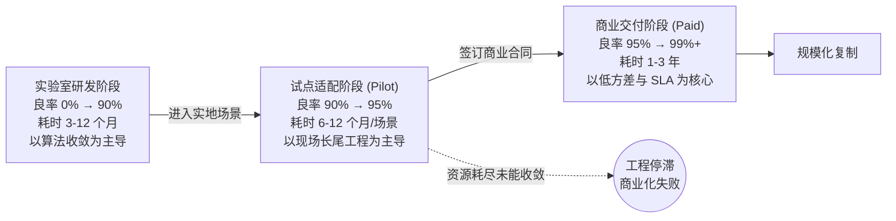

# 第 12 章 部署工程与现场落地

> 从实验室受控基准走向客户现场的物理交互，是绝大多数具身机器人团队面临的最严峻工程考验。本章不探讨如何在理想仿真中训练出 95% 的通过率，而是深入剖析这 95% 的实验室指标在进入非结构化真实环境后为何迅速跌落至 60%，以及如何通过工程架构与运维闭环将其稳步拉升至可交付标准。

---

不妨复盘一个典型的具身服务机器人试点部署案例：某团队研发的双臂服务机器人，专用于餐后桌面清洁与器皿归位。在实验室受控环境中经过长达三个月的密集测试，在最终验收周连续多日取得了 94% 至 96% 的单任务成功率。随后，样机被送入真实的家庭公寓开展现场试运行。

实地运行的第一天，任务良率跌落至 71%；第二天降至 64%；第三天进一步下滑至 58%。

系统监控日志清晰呈现了多维度的现实扰动：

现场客厅照明照度较实验室基准低了约 1.5 个档位，餐桌材质的光学漫反射特性发生改变，导致 VLA 视觉编码器对半透明餐巾纸的边缘分割产生几何模糊。住户饲养的宠物犬走近并卧倒在机器人脚侧，底盘局部避障模块将动态生物误判为静态凸起包围盒，规划器绕行至中途因障碍物突发微小位移而引发时序死锁，最终触发 40 秒安全超时截断。家庭 Mesh Wi-Fi 在跨房间漫游切换 AP 节点的瞬间发生数据包抖动，导致云端规划器 RPC 请求重试超时断开。次日保姆清扫时将餐椅挪动至餐桌对侧，机器人的语义拓扑建图未及时更新局部占用栅格，机械臂末端在轨迹插补时直接与椅腿发生物理干涉。

**实验室与真实场景的性能断层，并非单纯的算法过拟合，而是环境分布外（OOD）扰动、无线通信时延抖动、动态障碍物干扰、极端光照漂移以及物理环境拓扑突变等多重物理因素交织的结果**。单个扰动项在经典控制中均有成熟对策，但在高维端到端交互中耦合叠加，便构成了系统退化的级联放大。在单一客户现场完成特定分布的适配收敛往往需耗费数月；而迁移至全新场景时，新的长尾特征又将引发新一轮指标回落。

---

### 从研发原型到商业交付的三阶非线性收敛

在许多初创团队的认知中，具身落地常被简化为一条平滑的线性演进曲线。然而真实的商业交付由三段斜率与优化目标截然不同的工程阶段构成：

**实验室研发阶段（Lab Benchmark）**：该阶段指标提升速率最快。依托端到端模仿学习、海量遥操作数据以及高吞吐仿真增广，在 3 至 12 个月内将特定任务成功率从零推升至 90% 已成为行业常见周期。

**试点适配阶段（Pilot Deployment）**：指标提升曲线发生显著钝化。从 90% 攀升至 95% 通常需要 6 至 12 个月。每进入一个新的部署场景，前数百小时往往集中于补全该场景专属的光照、反光与非标物体几何分布。

**商业交付阶段（Paid Customer & SLA）**：系统优化的核心诉求从“提高平均成功率”全面转向**“极度压低方差与保障确定性服务质量协议（SLA）”**。对于付费客户而言，一个具备 95% 平均良率但偶发 1% 严重损毁事故（如打碎贵重器皿）的系统，其商业价值远低于一个稳定在 90% 但具备 100% 故障安全自锁的保守系统。客户采购的本质是业务确定性，而非统计期望值。

---

### 突破 99% 可靠性壁垒的工程代价

在物理系统的可靠性工程中，从 90% 跨越至 99% 所需付出的工程资源，通常是前 90% 阶段的 5 至 10 倍。

前 90% 的性能提升主要覆盖分布内（In-Distribution）的高频特征，可通过规模化数据直接拟合；而后 9% 则完全由稠密的长尾场景构成：特定入射角眩光、异形透明容器、极具迷惑性的宠物毛发纹理。长尾工况在单点上的命中概率极低，但其在现实维度的积分却构成了阻碍系统跨入工业级可用的全部鸿沟。

攻克长尾瓶颈无法单纯依赖单一大数据集的一次性训练，而必须依托严密的闭环数据飞轮：**现场微观失效捕捉 $\to$ 自动化切片标注 $\to$ 注入训练流形 $\to$ 影子模式校验 $\to$ 灰度 OTA 迭代**。

针对长尾问题的工程解耦必须遵循分桶原则：
- **感知层长尾**：通过难例挖掘与针对性数据增广进行流形重构；
- **规划层长尾**：引入确定性规则与因果断言进行状态自锁；
- **控制层长尾**：优化低层阻抗参数与力矩观测器带宽；
- **硬件层长尾**：迭代机械公差与引入传感器硬件冗余。

---

### 具身现场试运行案例的工程启示

审视行业内典型的现场试点项目，可以提炼出关键的工程经验：

**仓储物流人形搬运试点（如 Agility Digit 部署）**：在真实物流枢纽中执行料箱转运。实际工况依托高度结构化的三维点云先验地图、标准化尺寸容器及稳定照明。这表明，**人形系统初期切入工业场景，依然需要构建在严格受控的环境子集之上**。

**汽车总装产线装配评估（如 Figure 02 在车厂评估）**：机械臂执行精密钣金定位与装配。在汽车制造标准下，任何微小的轨迹超调均涉及高昂的产品报废与产线停机成本，系统必须深度嵌入车厂原生的质量管理流程。

**家庭环境自主交互探索（如 1X NEO Beta 试运行）**：在初期进入家庭时，通过低延迟远程遥操作（Teleoperation）在后台进行兜底接管，逐步实现复杂任务向全自主策略的过渡。将真实的家庭交互直接转化为带标签的高价值训练语料，构成了极具生命力的数据闭环体系。

**分级人机共融架构（如 Sanctuary AI Phoenix）**：显式解耦全自主运行、远程局部协同与完全遥操作接管三级响应机制。承认当前端到端模型的鲁棒性边界，并将结构化的人工介入作为保障商业 SLA 的确定性屏障。

---

### 现场部署的核心指标体系

衡量现场部署成熟度，必须摒弃单一的演示成功率指标，转向多维运维指标群：

**人工介入率（Intervention Rate）**：平均每运行小时需要人工接管的频次。在工业产线中，0.5 次/小时通常被视为商业准入门槛；而在家庭服务场景中，必须压降至 0.1 次/小时以下方能达到用户的容忍阈值。

**系统级平均无故障时间（MTBF）**：覆盖软硬件全部异常（控制超时、热保护触发、网络掉线未能自愈）。工业级场景以数百小时为核算基准，消费级场景则要求以连续稳定运行天数为评估尺度。

**单位时间任务吞吐量（Tasks Per Hour, TPH）**：系统完成标准化作业的动力学节奏。执行时延过长的策略难以维系合理的投资回报率（ROI）。

**任务空间覆盖率（Task Space Coverage）**：设备在目标物理空间内能够全自主覆盖的目标技能占比。

**单任务综合全生命周期成本（Cost Per Task）**：将设备折旧、电费能耗、远程操作员薪酬分摊、云端算力消耗及现场运维巡检开销综合折算，作为验证商业可行性的终极标准。

---

### 具身 OTA、遥测监控与影子模式

相较于纯软件系统，物理具身设备的在线迭代伴随着极高的物理破坏风险：

**分级灰度与空中升级（OTA）规范**：
- 严禁向实机直接推送未经实物回归的全新动作策略；
- 遵循“内部高应力回归 $\to$ 现场影子模式（Shadow Mode）比对 $\to$ 小比例灰度放量 $\to$ 全量更新”的严密发布流程。

**影子模式（Shadow Mode）的数学验证**：新一代 VLA 策略在端侧与当前主运行策略并行前向推断，但不向底层电机下发动作量。系统实时计算新旧策略动作分布的马氏距离或 KL 散度，当且仅当分布偏移收敛且预测轨迹无碰撞风险时，方可申请切流接管。

**多模态遥测（Telemetry）与隐私安全边界**：现场产生的高维传感器流必须在端侧完成特征抽取与敏感信息脱敏（如人脸与私密空间局部模糊化），仅向云端回传低带宽的动作残差与失败片段时序特征。

---

### 商业交付模式与工程架构的映射关系

商业交付架构的选择，直接决定了底层软件栈的研发重心：

**机器人即服务（Robot-as-a-Service, RaaS）**：按运行工时或有效作业吞吐量计费。该模式要求研发团队重点攻关高并发远程监控平台、毫秒级介入通道、高可用遥测告警及精细化计费计量模块。

**整机买断与本地化交付**：该模式要求系统具备完全离线的本地自主决策能力、完备的端侧故障自诊断系统以及高度简化的现场环境标定工具链。

**工程启示：在产品生命周期初期，聚焦于高确定性、低多样性的垂直狭窄场景（如标准化仓库物料转运、医院特定器械配送），其技术收敛速度与商业存活率远高于盲目追求全开放环境的通用平台**。

---

## 练习

1. **测算现场试运行的人工干预成本**：假定一个拥有 20 台移动操作机器人的商用试运行车间，平均介入率为 1.2 次/小时，单次远程接管平均耗时 3 分钟。计算维持该车队运转所需的最低专职遥操作员配置及其人力成本分摊。
2. **设计具身策略的影子模式校验器**：编写一段 Python 逻辑，输入当前主控制器的期望末端轨迹与新策略网络的推断轨迹，基于速度、加速度及障碍物距离阈值，设计一套动作安全性评分与告警判定算法。
3. **制定多维 SLA 服务质量协议指标**：针对某半导体洁净室晶圆盒搬运场景，起草一份包含 MTBF、最大允许干预率、通信中断降级策略及物理碰撞赔付边界的工程技术规格书。
4. **构建长尾失效归因与回流工作流**：绘制一张完整的工程数据回流架构图：展示从实机触发碰撞停机开始，如何自动截取前后 5 秒的传感器多模态缓存、在端侧实施隐私脱敏、通过低带宽通道回传云端并触发自动化测试用例构建的全流程。

下一章：[第 13 章 团队与资本](13-team-and-capital.md)

