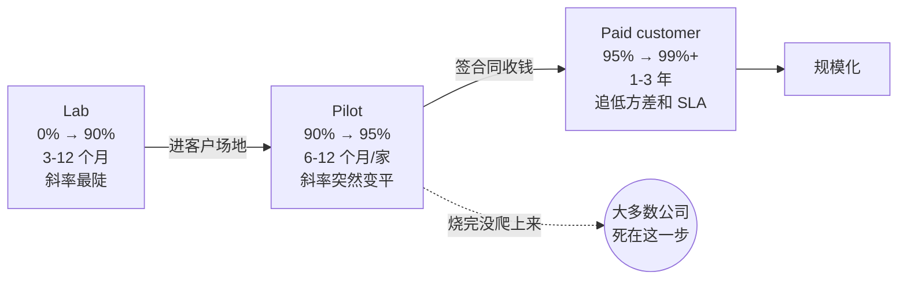

# 第 12 章 部署

> 从 lab 到客户家这段路，多数具身公司都没能走过去。这一章不讲怎么训出 95%，讲那 95% 进了客户家怎么掉到 60%，又怎么一步步爬回来。

---

不妨看一看 2025 年春天 pilot 现场的典型走势。一家刚拿了 A 轮的家庭机器人公司，做的是擦桌子与收拾餐具。团队在 lab 里连着跑了三个月，天天验收，最后一周连续五天的 task success rate 都稳在 94-96%。机器人装进白色泡沫箱，送去 Mountain View 一位工程师的两居室做家庭试用。

第一天 71%。第二天 64%。第三天 58%。

Slack 上的 log 一路贴到凌晨三点，拉出来的问题清单大致是这些：

客厅的灯比 lab 暗了 1.5 个档，餐桌反光全变了，VLA 辨不清餐巾纸的边缘。家里那只 12 公斤的拉布拉多走过来嗅了嗅机器人，接着趴在脚边；机器人的足下避障模块把狗当成静态物体去绕，绕到一半狗动了，机器卡在原地干等了 40 秒，随后报出 timeout。Wi-Fi 是 mesh 组网，机器从客厅走到厨房切换了 AP，云端 planner 那次 RPC 调用重试两次后直接断开。第二天客户家保姆来打扫，顺手把一把椅子从原位挪到了餐桌另一边，机器人 VSLAM 的地图没有更新，规划路径直接撞上了椅腿。

lab 到家的差距不是模型本身的问题，而是分布外、网络抖动、人和宠物走动、光照改变、家具挪位全混杂在一起的问题。每一项单拎出来都是已知的，叠在一起就是全新的。要把那台机器人在那一户人家里重新拉回 90%，通常要耗上四个月。可换到下一户，成功率又跌回 60%。

听着夸张，却绝非孤例。同一时期做工厂场景的几家公司里，进场第一周从 lab 数字往下掉 25 到 40 个百分点是常态，哪怕掉得最少的也丢了 15 个点。掉落的来源大致五五开：一半是实打实的环境分布外，VLA 没见过那种地砖反光、那种工件颜色、那种工人工服图案；另一半纯粹是工程问题，网络抖、电源不稳、现场温度比 lab 高 8 度直接让相机自动曝光走样。前者修好一次就管用一次，后者每换一个新场地都得重修一遍。

这一章要讲的，正是这件事。

---

## lab 到 pilot 到 paid customer 是三段不同的路

在不少创始人的设想中，这是一条笔直的线性曲线：lab 数据多了 → pilot 部署一点 → 客户付钱。这种想法是错的。摆在面前的，分明是三段斜率完全不同的曲线。

**lab 阶段**的斜率最陡。从零做到 90% 的 task success，靠端到端 + teleop 数据 + sim 兜底，一年之内拿下来并不稀奇。到了 2024 年，OpenVLA、π0、GR00T 更是把这一段的门槛压低，某些任务甚至三个月就能交出一个 milestone。

**pilot 阶段**的斜率会突然变平。离开 lab 之后，想从 90% 提到 95%，在现场常常要花上 6 到 12 个月。每进一个新场地，头两周基本都在填补这个环境特有的分布。Agility 的 Digit 在 GXO 仓库（2024 年初开始正式商用 RaaS（Robot-as-a-Service：客户按小时/按月付费用机器人，不买断）部署）跑到第三个客户场地时，公开过一组数字：每个新场地的前 200 小时全由 deploy team 坐在现场逐项调整，第二个 200 小时转为远程协助为主，熬过 800 小时之后才逐渐贴近 lab 里的数字。

**paid customer 阶段**的斜率迎来了第三次转向。客户一旦真金白银掏了钱，你在乎的便不再是更高的 success rate，而是更低的方差和更容易兜底的 SLA（Service Level Agreement：服务质量合同，比如“每小时至少完成 X 个任务，否则扣费”）。一个平时能做到 95% 却偶尔有 1% 概率失手把碗摔了的机器人，远比一个每天稳定 88% 从不出意外的机器难卖得多。客户买的是确定性，不是均值。这件事 Locus Robotics 在自家的 RaaS 合同里早早想透了，他们签给 DHL 这种客户的 SLA，白纸黑字写的是“每小时拣货数下限”，从来不写平均拣货数。

---

## 99% 那条墙

从 0 到 90% 是一条往上走的曲线，从 90% 到 99% 却是一面结实的墙。

行内的经验数字大致如此：0 到 90% 的工程成本，跟 90% 到 99% 的工程成本相比，比例在 1 比 5 到 1 比 10 之间。这条规则在自动驾驶领域被反复验证过，Cruise、Argo、Waymo 都在 99% 后面那最后两个 9 上耗费了几十亿美元。如今的具身机器人，正踩在同一个坑里。

究其原因，前 90% 覆盖的大多是分布内的常见行为，靠堆数据尚能解决；后 9% 面对的则几乎全是 long tail：某个特定角度的反光、某种此前没见过的容器、某户客户家里特有的家具格局、某种罕见的宠物毛色让 vision encoder 误认成了抹布。每一种 case 单独出现的 hit rate 也许只有千分之一，凑在一起却恰好填满了从 90 到 99 的所有缺口。long tail 不可能靠某一个新数据集单枪匹马地解决，它必须交给一套闭环流程：现场采集 → 标注 → 进训练集 → 重新部署 → 看 telemetry → 再迭代。

这也是大部分 A/B 轮具身公司倒下的地方。他们靠着跑出 90% 的 demo 拿到下一轮融资，随后花上 18 个月去追赶剩下的 9%，手头的资金耗尽了，产品却还差着一截。写在墙上：90% 不是产品，95% 不是产品，99% 才刚刚拿到产品的入场券。家庭场景比工厂场景还要苛刻，往往还要再往上加半个 9，因为家里没有 maintenance window，没有 IT 部门，普通客户的容忍度跟 lab 里的工程师根本不在一个量级。lab 工程师看见机器人卡住会兴奋地打开 log，客户只要看见机器人在眼前卡住第三次就会选择退货。

要翻过这面墙，没有捷径，却有一套成熟的章法。最根本的办法是先把 long tail 分桶：哪些是感知问题、哪些是 planner 问题、哪些是控制问题、哪些是硬件问题。每一桶都要用不同的手段去处理。感知的 long tail 扔进训练集，planner 的 long tail 写硬规则兜底，控制的 long tail 调整阻抗参数，硬件的 long tail 则改动 BOM 或追加冗余传感器。若是把所有问题混在一起，这面墙就永远也爬不过去。

---

## Pilot 案例的真东西

不妨挑选五个公开了信息的 pilot 案例来看一看。在每个例子底下，只挑出一两件别人在 marketing 宣传里鲜少主动谈起的实情。

**Agility Robotics Digit at GXO / Amazon**（2024 起）。Digit 在 GXO 的 Spanx 仓库搬运 tote，算得上眼下最接近真正商用的人形 pilot。它采用 RaaS 模式，按小时收费，公开披露的价格大概在 30 美金/小时这一档。GXO 自己的 supply chain VP 曾在 2024 年的财报会上讲过一句业内人都听得懂的话：现阶段成本其实还没有人工便宜，但他们是为了给下一代打基础。Digit 在仓库里能跑起来，靠的是预先 mapping 过的环境、固定的 tote 类型与受控的灯光。别拿“人形已经在仓库工作”当成通用具身已成的证据，它只是在一个高度受控的子集上运转。

**Figure 02 at BMW**（2024 起）。Figure 把 02 部署到 BMW Spartanburg 工厂做 sheet metal 装配。Figure 公开过的 video 看起来非常成熟，BMW 这边的公开表态却克制得多：目前仍处于 evaluation 阶段，并未进入产线。这个区别非同小可。“在产线旁边走”和“在产线上担责任”从来不是一回事。真正进产线意味着任何一次失败都要走 BMW 的 quality 流程，赔的是车，不是 demo。

**1X NEO Beta**（2024 年底起在选定家庭试用）。1X 是这一波里最早把人形送进真实家庭的公司。他们自己讲得很坦白：NEO 在家里的大量任务是通过远程 teleop 接管完成的，他们把这件事明明白白写在产品页和访谈里。1X 的 CEO Bernt Børnich 在 2024 年的几次访谈中聊起过 roadmap：先把 teleop 跑通，然后慢慢把更多任务从 teleop 转为 autonomy，把每户家庭采到的数据回训模型。这是非常聪明的部署策略：拿真实家庭当数据采集源，同时用远程的人工保障服务质量。

**Apptronik Apollo at Mercedes-Benz**（2024 起，德国 Sindelfingen 厂）。Apollo 在 Mercedes 做 case 搬运。Apptronik 跟 Mercedes 都没有公开过具体的效率数字。这本身就是一个信号：当 pilot 部署方都不愿意贴出具体数字时，通常意味着数字还没到值得贴出来示人的位置。

**Sanctuary AI Phoenix**（加拿大，泛工业 pilot）。Sanctuary 是这一波里把“远程人介入”在工程上做得最透的一家。他们的 control system 公开过分层：自主、远程协助、远程接管，三层动态切换。这套架构的好处在于从不假装“全自动”，而是直接把人留在系统里当成一个带有 SLA 的兜底层。这个立场看起来不够性感，却最接近 2026 年的真东西。

把这五家排在一起会看到一件事：当下没有任何一台人形机器人，能够真正全自动地跑在客户家中或工厂车间里。所有看似“全自动”的演示，背后要么有 lab 工程师远程盯着，要么有 teleop 操作员随时待命，要么有现场的 safety operator 寸步不离。这不是丢人的事，而是客观的工程现实。把这件事原原本本地讲明白，远比费尽心思去包装它，对客户、对投资人、对自己的工程团队都更为健康。

---

## 部署时该看的指标，不是 demo 里那几个

Demo 是演给外人看的，台上亮一个 task success rate 就够了；真到了 pilot 部署阶段，工程团队自己得看另一套账。

**Intervention rate**：每小时究竟需要人工接管几次。在当下所有机器人公司内部，这是分量最重的一个单一指标。1X 拿它当 KPI，Sanctuary 直接把它写进客户合同。至于降到多少才算能用，仓库与工厂里大概 0.5 次/小时是商用门槛，进到家庭环境，通常要压到 0.1 次/小时才算“客户能忍”。

**MTBF (Mean Time Between Failures)**。这里的 failure 指的不单是软件报错，而是任何需要人去现场收拾局面的意外：机械臂卡住、撞到障碍物、关节过热、电量跌破阈值，或是 wifi 断开后没能自动连回去。在工厂里，MTBF 尚且可以按小时算；放到客户家里，这根标尺必须按天来量。

**Tasks per hour**。光盯 success rate 说明不了问题，真正要紧的是单小时的吞吐量。一台成功率 95% 但做一件事要耗上 10 分钟的机器人，比起另一台成功率 88% 却只要 3 分钟的机器，后者的商业价值反倒要大上三倍。

**Coverage**：也就是机器人在客户现场究竟能接手期望任务的百分之几。如果前期向客户许下了家里的 50 件事，落地后却只能做 12 件，对方买不买单，并不取决于这 12 件事干得多漂亮，而是剩下的 38 件事你手里到底有没有清晰的 roadmap。

**Cost per task**。把硬件折旧、电费、远程协助 operator 的工资、云端推理开销与现场运维的上门成本一股脑加在一起，再除以总任务数。按这个账本算下来，如今绝大多数家用机器人都是在做赔本买卖。像 Locus 这样老牌的仓库 RaaS 厂商，用了整整十年才把 cost per pick 磨到接近人工劳力的水准。至于家用机器人赛道，至今没有哪家敢把自己的 cost per task 摊开给外人看，道理很简单：一旦把分母里的 operator 工资加进去，算出来的数字未免太过难堪。

唯有把这五个数字摆在一块看，露出来的才是真实底细。单看 task success rate 只是做 demo 的思维。当一个 dashboard 上排开这五条曲线，每周坐下来复盘谁在走高、谁在恶化，让公司里各个岗位的同事都能对着同一张图达成共识，一个 deploy 团队才算真正入了门径。

---

## OTA、telemetry、shadow mode、A/B：机器人 deploy 跟 web 不一样的几件事

机器人的 deploy pipeline 乍看之下和传统的 web 架构差不多，可内里有几桩根本性的差异，必须在一开始就想明白。

**OTA** 绝不能随便 push。给 web 应用推一个带 bug 的版本，用户顶多刷出一页报错；要是给机器人推错一段逻辑，它下一秒就能在现场把东西砸得粉碎。正因如此，规矩严密的具身团队部署起来都按部就班：先在内部测试机上跑通完整的 regression，接着挂进 shadow mode（新模型在线推理却不输出动作，纯粹拿去比对旧模型的 logits），随后开放 1% 客户做灰度放量，最后才敢全量推开。在真正的工程文化里，任何跳过 shadow 的部署都不该被容忍。Tesla Autopilot 花了整整十年用鲜血换来的教训，具身机器人眼下正原样重新领教一遍。

**Telemetry** 本身就是产品。扔在客户家里的那台机器人，每天吞吐着 GB 级别的 sensor stream。到底哪些数据要传回服务器、哪些只能锁在本地、数据回传占多少延迟与带宽预算、隐私的边界究竟划在哪里，都不是后期打补丁的运维琐事，而是产品定义的第一道门槛。不做 telemetry 规划的部署无异于在夜里盲飞。1X 曾经对外公布过 NEO Beta 的隐私模式，允许客户一键关停特定房间的视觉画面回传；这套机制压根不是隐私合规工程师提出来的，而是销售跑出来的需求，原因再朴素不过：客户不准机器人进卧室。

**Shadow mode** 是新模型上线前必经的法定通道。新训练好的 VLA 模型在客户现场照常推理却不发出物理动作，只管拿自己的输出与旧版 VLA 的 action 计算 distance。凡是 distance 偏离过大的样本，通通抽调回 lab 供算法人员复盘，直到整体 distance 的分布彻底收敛平稳，才正式切过流量。这套打法在自动驾驶行业早已是默认常识，而在具身机器人领域，直到 2025 年才渐渐摸索出一套通用的标准。

**A/B 部署**搬到物理世界会显得格外别扭。Web 端的 A/B 测试能在用户层面做随机分桶，可到了机器人这里，划分粒度只能落到一台台具体的硬件上。你不能让同一台机器这一秒跑模型 A，下一秒就切去模型 B，policy 在切换瞬间的动态响应极易惹出麻烦。因此分桶通常只能按机器人 ID 或是按不同的场地来切分。这也意味着 A/B 的统计 power 比 web 端低了整整两个数量级：此时公式里的 N 不再是 100 万个活跃用户，而是区区 100 台机器人。不少从 web 转入具身赛道的 ML 工程师，起初都低估了这件事的残酷。

---

## 客户介入闭环：把人留在系统里，明明白白留

前面聊到过，“当下所有全自动都是把人藏在了介入接口后面”。这句话落到工程实践里，其实有着极其具体的构造形态。

**远程 teleop 接管**。1X 这一派团队早就公开承认，家庭场景里的海量任务其实是靠远程操作员实时“开”出来的。客户在自家客厅看见的是“机器人在帮我洗碗”，千里之外的挪威或菲律宾办公室里，正坐着一位头戴 VR 设备的专职操作员，通过低延迟专线远程操控那台硬件。这条技术路线对延迟苛刻到了极点：控制链路压在 120ms 以内才勉强能用，一旦飘过 200ms，任何涉及接触受力的精细任务就根本没法做了。

**远程协助**。这比直接 teleop 弱上一档：操作员并不亲自掌舵，只在机器人卡住时给出离散的高阶指令：“右边那个杯子是装满水的，先别动那个，先收拾左边的盘子”。这种交互频率每小时不过数次，一个操作员足以同时照看 5-10 台机器人。Sanctuary 与 Diligent Robotics 押注的都是这一套方案。

**本地手势接管**。家里的客户或工厂的工人按下机身按键、比划一个手势、或者喊一声“停”，机器人都得立刻交出控制权。这套交互听着寻常，在工程细节上却极难做扎实：手势识别绝不能频频误触，环境嘈杂时那声“停”万万不可漏听，物理急停开关的位置更要确保任何人在任何姿态下一伸手就能拍到。Apptronik 将 Apollo 派往 Mercedes 现场作业时，身边就专门配了一位 safety operator，手里时刻攥着一个无线急停控制器。

把上面这三层网严密地叠扣在一起，你手里才算有了一套真正“能在客户现场跑起来”的系统。脱离了这三层兜底，演示视频拍得再花哨漂亮，也绝无可能走进商业交付。

这套介入闭环还有一个常被外界低估的副产品：它本身就是质量最高的数据金矿。操作员的每一次接管，都精准暴露了自主策略在那个瞬间的无能为力，而人工接管留下的动作轨迹，恰恰是一条天然打好标签的高价值演示数据。1X 在公布自身 strategy 时就点明过这一逻辑，他们把真实家庭环境里 teleop 采集的轨迹，全数回流训练进下一代 NEO 模型中。这种“先由人工兜底保障服务，顺手把人工操作沉淀为数据”的飞轮，是当下一众具身玩家身上最神似 Tesla 早期 fleet learning 的地方。一家公司要是缺了这套介入闭环，前头给不出服务兜底，后头拿不到真实分布的现场数据，两头落空，等于全盘皆输。

---

## SLA 和合同：行业还在摸索的那一段

机器人的 SLA 没法套用 SaaS 的老规矩。SaaS 谈 SLA，翻来覆去无非是 uptime 到底保 99.9% 还是 99.99%；而机器人的 SLA，是一组错综复杂的多维向量。

合同里要写哪几条？至少得有这些：

每小时允许人工 intervention 的次数上限；每天机器彻底脱离看管、完全自主运转的 unattended 最长时长；MTBF 的指标下限；故障发生后 24 小时内必须派人到场的履约承诺；每月推送 software update 的频次与版本回滚保障；客户现场数据回传时的隐私边界；再加上机器一旦造成财产损害时的赔偿上限与保险归属。

这一长串条款，在整个 service robotics 行业至今还没有一份公认的通用模板。像 Locus Robotics 这样成熟的 RaaS 厂商，之所以能在仓储物流行业把条款拆解得分明，是因为客户车间里的工种和作业流早被卡得死死的；而在家用机器人这边，几乎还是一片荒原。据说 1X 当初推 NEO Beta 时，早期客户合同全是一家一户单独谈判敲定的，每家手里的条款都不重样。

这套规矩会在未来 18-24 个月内，被几场硬碰硬的官司或者几次大规模召回逼出一个事实标准。最早进场摸索的头部公司，会用自己起草的合同范本反向塑造整个行业的规矩。眼下你在条款里随手写下的一句话，保不齐就会变成 2028 年全行业默认的行规。

还有一块拼图眼下几乎一片空白：商业保险。家用机器人失手砸碎了一台 5000 美金的电视到底由谁买单，碰伤了人谁来赔付，撞到了宠物又该如何定责。Allianz、Munich Re 这类保险巨头在 2025 年前后才着手立项研究具身机器人专属险种，至今连一款成熟的标准化产品都没拿出来。没有现成的保险产品托底，就立不起标准化的客户合同；而没有标准化的合同文本，规模化部署便无从谈起。这道悬而未决的难题，正是横在整个行业面前的一处隐形路障。

---

## 买断 vs RaaS：定价模式不是商业问题，是工程问题

机器人到底该怎么往外卖，行业里眼下能看清的有四条典型路径。

**买断**：客户一次性掏钱买走硬件资产，软件订阅费按期另算。Boston Dynamics 旗下的四足机器狗 Spot 走的便是这种传统路子，单台硬件售价大致落在 7-10 万美金区间，往后另外叠加 enterprise 级别的软件订阅。

**纯 RaaS**：客户按运行工时或实际完成的任务量来结账。Locus Robotics 的仓储机器人按照挑拣出的货品件数按量计费，Diligent Robotics 投放在医院里的 Moxi 机器人按月收取服务费，Agility Robotics 的双足机器人 Digit 同样押注 RaaS，在 2024 年对外披露过约 30 美金/小时的收费口径。

**混合**：前期硬件全款买断，后期按实际处理的任务量收取服务分成。目前业内仅有少数对标 vertical SaaS 的商业团队在做这种试水。

**赠送 + 数据**：硬件以极低价格甚至免费直接送进客户家门，作为对价，客户允许设备采集真实生活数据并回流训练。1X 在 2024 年推开 NEO Beta 的早期种子客户时采取的正是这套做法，骨子里带着非常浓厚的 Tesla 早期影子。

定价模式摆在台面上看似是商业策略，深究到底全是一道道工程取舍。选了 RaaS，就意味着你必须把一套繁重的底层基建搭齐：远程监控链路、24/7 轮班的 operator 队伍、精确到小时的 metering 计费系统、SLA 异常告警、远程 OTA 通道和远程协助接口；而选了买断模式，工程重心则要全数倒向另一端：单机本地自治、客户自行运维的工具箱、本地故障诊断 UI 加上对接客户现有 IT 系统的适配层。在没敲定商业卖法之前，工程团队根本不知道手里的预算该往哪个技术方向砸。许多创始团队一路摸爬滚打熬到 B 轮才悟透这层因果，白白耽误了一整年。

---

## 立场：垂直窄，比通用大一万倍重要

最后留一个立场。

这两年，所有具身公司的 deck 上几乎都印着一句“我们做通用平台”。这话为什么印上去，谁都明白：投资人喜欢通用平台，图的是 TAM 够大。可通用平台得去解决无穷无尽的 long tail，而砸进 long tail 里的钱，永远也花不完。

**垂直场景**意味着一系列确定的边界：固定的客户类型、固定的任务子集、固定的环境复杂度、固定的 SLA 模板、固定的合同模板，还有固定的 deploy 流程。每一个“固定”，都在替工程团队削掉一个数量级的复杂度。Locus 只做仓库拣货。Diligent 只在医院里送药送检。Boston Dynamics 的 Spot 在 inspection 这一垂直里磨了七年才开始赚钱。垂直窄，比通用大一万倍重要。

通用平台不是不能做，但那是 D 轮以后的事，绝不是 A 轮的事。A 轮就喊着做通用平台的公司，绝大多数会在 B 轮到 C 轮之间死掉。Boston Dynamics 做了三十年，才在 inspection 这一窄垂直里盈利；Locus 做了十年，才在仓库拣货里跑出盈利。具身大模型把上限抬高了，却没把垂直要窄这条规律拿掉。这一代机器人公司的赢家，最先做到第一千万美金 ARR 的，几乎肯定是从一个非常窄的场景里走出来的。

---

## 练习

**找一段最近的人形机器人 demo video**（Figure、1X、Apptronik、Sanctuary、Agility 任选）。对照这一章讲过的指标重新看一遍：你能从画面里推测出它的 intervention rate 吗？画面剪辑里有没有提示远程协助留下的痕迹（语音延迟、镜头切回、外部控制台）？看完之后，再去读这家公司同一时期的官方 blog 或访谈，拿你的推测和官方说法比对一番。

**挑一家做 service robot 已经盈利或接近盈利的公司**（Locus Robotics、Symbotic、Diligent Robotics、Boston Dynamics 的 Spot 业务），找找它的 RaaS 合同模板或 case study。把它的 SLA 条款抄下来，逐条去问：具身大模型时代的人形公司能不能照搬这一条？为什么不能？

**画一张你自己产品的“99% 路线图”**。假设手头产品的 task success 现在是 90%。从 90% 到 99% 这九个百分点，你打算怎么往上爬？每挣一个百分点的增量，靠的是数据、分层、远程介入，还是靠缩小 scope？写完之后给自己估算一个总成本和总时间。如果这个数字让你觉得不舒服，说明你的 roadmap 还不诚实。

**找一个你认识的具身机器人创始人，问一个问题**：你的第一个付费客户在哪个城市，第一年合同金额多少，去年这个客户续约了吗。三个问题里只要有一个答不上来，无论 demo 演示得多么漂亮，这家公司都还没真正开始 deploy。

---

下一章：[第 13 章 团队与资本](13-team-and-capital.md)
